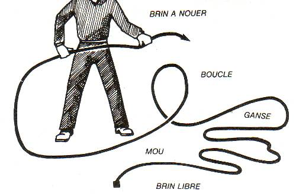
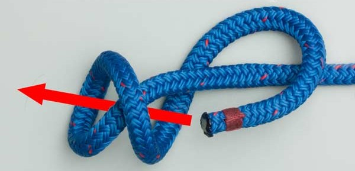
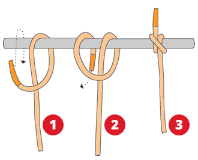

## Introduction

> De nombreuses liste de noeuds existe, celle ci est proposée car elle a était affinés autour de trois critères: simplicité d'apprentissage (que 5 noeuds a apprendre car les trois restant sont quasiment identiques), exhaustivité (répondent à 99% des situations), adaptabilité (des nœuds rapide, facile à défaire et d'autres nœuds reconnue comme les plus fiables).

On va apprendre une liste de huits noeuds et certaines bases de l'art de faire des nœuds. Pour commencer un brins de vocabulaire cas nous aider à manipuler notre corde et faire nos noeuds:

- Brin à nouer ou courant
- Brin libre ou dormant 
- Ganse
- Boucle

Il nous faut un peu plus d'informations avant d'attaquer les noeuds. Voyons quelques catégories de Noeuds :
- **Les noeuds d'ajut**: permettant de joindre deux extrémités de corde 
- **Les noeuds d'accroche**: permettant de se fixer a un objet
- **Les noeuds d'arrêts**: permettant de nouer une extrémités pour éviter qu'elle glisse a travers une poulie, un trou, un noeud ou tout autre équipement
- **Les noeuds de boucle**: permettant de former une ou plusieurs boucle pour l'amarrage, créer des points de fixations ou faire glisser une corde.

## Noeuds

### 1. Noeud de huit

Le noeud de huit est un noeud d'arrêt. C'est un noeud en bout de code permettant d'empêcher que la corde glisse ou se dégaine (sur les cordes gainés où les brins du noyau se décalent où s'enlèvent de la gaine protectrice).

### 2. Double noeud d'arrêt

Le double noeud d'arrêt est comme son nom l'indique un noeud d'arrêt. C'est un noeud utilisé souvent pour empêcher des nœuds moins fiable de se défaire. On l'utilise également en bout de corde pour les mêmes raisons que le noeud de huit.

### 3. Double noeuds de huit

Le double noeud de huit est un noeud de boucle. C'est un noeud très fiable mais qui est difficile a défaire contrairement au suivant.

Noeud de huit passant au travers d'une boucle fixe :

### 4. Noeud de chaise

Le noeud de chaise est un noeud de boucle facile à défaire même après de grande charge ou tension.

### 5. Noeud d'écoute

Le noeud d'écoute, un noeud d'ajut permettant de relier deux cordes, se réalisent comme le noeud de chaise mais où la boucle est "couper". 

Le résultat:

### 6. Double noeud du pêcheur

Le double noeud du pêcheur est également un noeud d'ajut. Il est composé de deux double noeud du pêcheur.

### 7. Le cabestan 

Le noeud du cabestan est un noeud d'accroche permettant de se fixer (de s'accrocher) à un objet de faible diamètre ou une corde. 

### 8. Le noeud du camionneur

Le noeud du camionneur (existe sous plusieurs formes mais ici a base demi clé gansé) est un noeud d'accroche servant surtout à tendre une corde ou tirer une charge.

> La corde à tendre ou la charge étant ici a gauche sur le brin libre.

> Le cabestan sur la photo entourant la grande de droite est l'étape finale une fois la corde tendu. Elle sert a bloquer la charge ou la tension.

Ce noeud étant plus complexe voici une vidéo pour le visionner en action pour la mise en place d'un abri a base de tarp

https://youtu.be/FnlaQHIoCs8?si=kFqFB4hHWTgAwTCn

## Pour finir

Voilà c'est tout, ces noeuds permette de couvrir tout les besoins en Bushcraft, en Survie, en scrambling et en escalade. D'autres nœuds existe et simplifie la vie la ou certains de ces noeuds sont moins pratique mais cette liste fonctionne et est à mon goût les plus polyvalent. Un guide de noeuds plus avancé est disponible mais je conseillerais vivement de maîtriser celà avant pour bien comprendre les enjeux des autres noeuds.