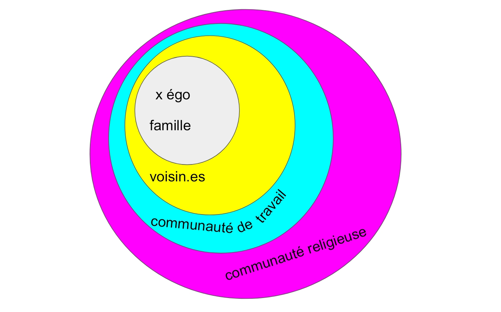
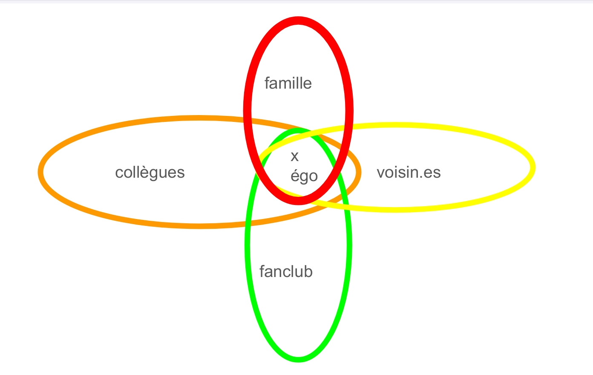

> [Accueil](../../) > [Portail philosophique](../) > Texte sur la condition humaine

## La condition humaine

### Pourquoi écrire ce texte ?

Ce texte s'inscrit dans l'ensemble des écrits du Mallouestan qui expliquent la manière avec laquelle nous cadrons nos activités et une éthique que nous pensons la plus juste. En l'occurrence, ce texte s'attèle à expliquer notre vision de la condition humaine. L'intérêt de rédiger un texte sur cette thématique est avant tout de déterminer ce qui est nécessaire à l'être humain -- et donc ce avec quoi nous devons composer --, et ce qui lui est contingent (qui pourrait ne pas exister) -- et donc ce dont nous devons nous départir dans la mesure du possible. A partir de là, il deviendra alors possible d'entrevoir dans une certaine mesure comment bâtir des sociétés adaptées aux êtres humains, et comment concilier l'existence de ces derniers avec celle des écosystèmes. Ce contenu théorique sert donc de base pour poser des règles aux comportements humains et sert de base pour dessiner un contexte au sein duquel l'épanchement des besoins de plaisir, par exemple, puisse être répondu de manière éthique. 

Ce texte a donc pour objectif analytique de mettre en exergue la contradiction fondamentale entre un mode de vie qui correspondrait aux êtres humains et le système actuel. Pour ce faire, il faudra se prêter à l'analyse de ce dernier et de ce qu'il cause aux individus humains et aux sociétés, sans évoquer particulièrement les conséquences sur les écosystèmes. Pour cela, nous allons notamment nous attarder sur les sociétés les plus favorisées, où tout semble aller pour le mieux, et moins sur les sociétés en guerre, en famine ou en régime totalitaire. D'autant plus que ces sociétés favorisées sont parmi les plus déterminantes de l'ordre mondial actuel, car ce sont des pays coloniaux, avec de grands groupes industriels et des armées en moyenne parmi les plus puissantes.

### Constats généraux

Tout d'abord, quelques constats généraux peuvent être présentés pour saisir l'importance de la situation.

Le capitalisme industriel s'est développé depuis la fin du XVIIIe siècle, et le florissement des civilisations occidentales par l'exploitation des ressources ne s'est pas seulement fait avec un progrès dans le rendement des machines, il s'est aussi fait par un accroissement de la mise au travail des humain.es1. Quand bien même on peut observer une relative amélioration des conditions du travail ouvrier en Occident sur certains aspects, avec la baisse du temps de travail ou le développement de l'ergonomie en usine, les conditions de travail dans lesquelles évoluent une grosse partie de l'humanité sont déplorables. Surchage, salaires bas, mauvaise posture, actions répétitives, ennui, pollutions, bruit, horaires inadaptées... sont courantes dans des emplois de nuit, sur une chaise, avec des pesticides, à la chaîne, "au cul d'une machine", dans le BTP, aux vendanges et bien d'autres. Elles engendrent des maladies neurodégénératives2, de la dépression, des troubles musculo-squelettiques, du stress, des burn-outs, etc. Il ne s'agit pas de dire que le travail de tout temps était bénéfique et sain -- l'esclavage n'est pas apparu au XVIIIe siècle -- mais que le capitalisme est aujourd'hui la forme dominante de l'organisation économique mondiale, qui ne laisse que très peu de place à des formes plus souhaitables et adaptables du travail.

L'humanité vit aujourd'hui majoritairement en ville, et ce phénomène va croissant3. Pourtant, le mode de vie urbain semble être la cause de bien des maux actuels. Le bruit des moteurs, celui de la VMC, la lumière des lampadaires la nuit, celle blanche des magasins, les bouchons au sortir du travail, la queue pour faire les courses, les visages impassibles dans la rue, la grisaille partout, les prairies et les forêts nulle part, l'isolement, les déchets dans les cours d'eau, l'air pollué, la petitesse des appartements, la pollution intérieure4... L'ensemble des désaggréments de la ville sont innombrables et certains sont propres à chacun.e d'entre nous. Ils sont cause de différents troubles sociaux et individuels tels que les dépressions5, les maladies cardio-vasculaires et respiratoires, le diabète de type 2, les perturbateurs endocriniens6, l'anxiété, l'obésité, l'ennui (cassé par les écrans en général), etc. Tout porte à croire que la ville n'est pas un environnement adapté aux êtres humains, et nous sommes tristes de voir les effets de la vie urbaine sur nos ami.es et nos familles. Ces constats vont à l'encontre de ce que la propagande libérale veut nous faire croire, que la ville est le lieu de tous les possibles, de la réalisation des rêves et de la consommation facile, du divertissement, de la culture, des arts, des loisirs, et il nous faudra développer cela plus longuement plus bas dans le texte7.

### De l'inadéquation entre la nature humaine et le développement civilisationnel

Selon nous, la plupart des malheurs non nécessaires que subissent les êtres humains sont dûs au processus de civilisation dont ils sont victimes, autant dans leurs corps que dans l'environnement au sein duquel ils évoluent. 

En effet, il y a plusieurs milliers d'années, à partir de quelques endroits du globe comme l'actuelle Turquie ou la région du Fleuve Jaune en Chine, les premières cités sédentaires ont vu le jour, accompagnées de grandes infrastructures, de grands travaux d'aménagement hydroliques, de l'accroissement des hiérarchies sociales, de carences alimentaires, de la colonisation, de l'exploitation massive des forêts et des mines, de la domestication massive de bétail, de l'impôt8... Ce processus a conduit à nos sociétés actuelles avec plus ou moins d'intensité selon les périodes et selon les régions, et nous sommes aujourd'hui les dépositaires d'une histoire d'urbanisation, de sédentarisation, d'intégration à l'appareil d'Etat et de mise au travail au service d'une classe dominante. 

#### Conséquences sur les corps et la santé

Nos corps et nos santés en font aujourd'hui les frais. Plusieurs exemples peuvent être donnés.

Notre dentition ne s'est pas adaptée à ce processus évolutif. En effet, beaucoup se font aujourd'hui retirer les dents de sagesse, désormais inutiles car elles servaient à mastiquer des aliments durs comme des cadavres crus ou certains végétaux, alors que la nourriture a de plus en plus été cuite et ramollie. La cuisson implique aussi qu'il est moins nécessaire de forcer sur les muscles de la mâchoire, et le volume de cette dernière ne permet plus d'accueillir les dents de sagesse9. De plus, le début de l'agriculture il y a environ 10 000 ans a vu le développement massif de caries -- amplifié depuis la consommation de sucre de canne lors de la période de la traite négrière. En effet, la consommation de céréales cuites favorise la plaque dentaire, et la consommation d'amidon fournit une nourriture pour les bactéries responsables des caries. Les chasseurs-cueilleurs mangeaient de la nourriture moins acide (ce que sont par exemple les boissons sucrées ou les boissons fermentées). Iels mastiquaient plus, et donc salivaient plus, la salive étant protectrice contre l'acidité et nettoyeuse des dents. Le taux de présence de caries chez les chasseurs-cueilleurs avoisinait les 2% quand celui des premiers agriculteurs se situe entre 25 et 50%11.

L'agriculture a crée un régime alimentaire moins diversifié et marque l'apparition de carences chez Homo Sapiens. Quand l'alimentation des chasseurs-cueilleurs était variée selon les lieux et les saisons, elle devient riche en céréales et perd en nutriments, en plus de les rendre vulnérables en cas de mauvaises récoltes. La masse des esclaves avaient de la bière comme base alimentaire (sorte de soupe), quand les quelques riches pouvaient se permettre la consommation de produits plus rares. La néolithisation se marque par une baisse de la taille moyenne chez les humain.es, principalement liée, semble-t-il, à la baisse de la consommation d'animaux et d'insectes (l'humanité ayant retrouvé sa taille d'avant le néolithique dans les années 1960, surtout parce que la consommation de cadavres a augmenté). On observe aussi des carences en vitamine B12, notamment apportées par cette même consommation à l'état sauvage (les animaux consommés actuellement ne fournissant pas assez cette vitamine). La pauvreté nutritionnelle conduit aussi à une perte dans la robustesse des os, à des carences en fer, en zinc, en calcium, en vitamines A et D, ce qui est aussi en partie dû à l'exposition moindre au soleil. On relèvre ainsi plus de malformations osseuses chez les premiers agriculteurs que chez leurs ancêtres12.

La néolithisation voit apparaître les premières épidémies. La concentration animale (humaine et non humaine) dans les "complexes de la domus"13 crée des conditions favorables aux conflits entre les bactéries et virus avec les systèmes immunaitaires à échelle inter-espèces. Ces conflits entraînent une escalade et une mutation des virus et des bactéries, forcées de s'adapter aux corps qui se renforcent eux aussi en moyenne. Les agents pathogènes deviennent alors de plus en plus puissants et destructeurs pour les corps qui ne se sont pas habitués à leur présence. En témoigne le choc viral causant une hécatombe chez les populations amérindiennes suite à l'arrivée des premiers colons européens14. Il est possible, mais ce n'est qu'une hypothèse, que des chasseurs-cueilleurs qui auraient avancé dans le temps jusqu'à aujourd'hui meurent au bout de quelques jours des suites d'une maladie ne causant chez nous que des rhumes et des maux de gorge. La cohabitation inter-espèces due à la domestication notamment des animaux est la source de nombreuses zoonoses [des maladies qui passent d'un espèce à un autre]. Ainsi, la grippe aviaire, la grippe espagnole15, la peste porcine ou encore probablement le Covid sont des zoonoses, et leur dangerosité ne fait qu'augmenter16.

Le mode de vie civilisé a causé d'autres troubles comme le diabète, notamment le diabète de type 2, le plus répandu. Celui-ci trouve différentes causes comme la consommation de sucre ou le pain blanc, créant des fortes montées d'insuline auxquels nos corps ne sont pas adaptés. L'absence de jeûne crée aussi des conditions favorables au développement du diabète. Le fait de faire moins d'exercice rend l'insuline moins efficace, et les muscles n'absorbent plus autant le glucose. L'obésité est elle aussi un facteur de diablète en tant que la graisse abdominale crée une résistance à l'insuline. Et ce mode de vie se répercute dans l'épigénétique, c'est-à-dire sur les générations suivantes. Par ailleurs, lorsqu'une population se sédentarise, on observe généralement une épidémie de diabète et/ou d'obésité, par exemple chez les Aborigènes australien.nes ou les Polynésien.nes17.

D'autres maux sanitaires trouvent leur origine ou leur explosion quand une population entre dans un mode de vie civilisé. Nous ne les avons pas tous développés, mais nous pouvons brièvement évoquer une suite de troubles : l'hypertenstion artérielle, les AVC, la maladie de Crohn18, la sclérose en plaque19, la plupart des cancers, l'asthme, les allergies, etc.

Tous ces problèmes de santé liés au processus de civilisation sont dûs à l'"incompatibilité évolutive" (Daniel E. Lieberman) ou au "désalignement évolutif" (Christopher Ryan) entre notre génétique paléolithique avec les villes, les supermarchés, les écrans, l'agriculture, la sédentarité.

#### Conséquences psychiques et sociales dues à l'environnement dans lequel Homo Sapiens évolue

Le début de la sédentarisation voit l'apparition d'un environnement nouveau pour Homo Sapiens. Champs, forêts rasées, densité de batiments, densité de congénères et d'autres animaux, enfermement (dans les maisons si ce n'est dans les prisons), etc. ; et plus récemment : usines, grisaille, lumières artificielles, écrans, moteurs, etc. Ce contexte n'est, lui non plus, pas adapté à la génétique humaine et à ses sociétés.

La métropole, notamment, est l'expression paradigmatique [typique d'une approche intellectuelle, d'un système de pensée] de cette réalité. Desmond Morris le décrit bien dans _Le zoo humain_. En effet, il met en avant le fait que l'environnement artificiel au sein duquel évolue Homo Sapiens perturbe ses instincts naturels tout comme pour les animaux non humains enfermés dans des zoos, avec pour conséquences de provoquer des comportements au mieux étranges et au pire criminels.

Le rythme de la vie urbaine, par exemple, crée du stress de manière plus ou moins intense en fonction des individus et des autres nuisances auxquelles ils font face. La surcharge cognitive, la surstimulation sensorielle en sont aussi des causes importantes. Ce stress peut s'envenimer en agressivité ou causer des dépressions. La pression de la charge de travail, des échéances de rendus de dossier, de la pression par la hiérarchie pour certain.es, de l'obligation de se lever tôt, de prendre le métro, d'arriver à l'usine ou à la gare routière (pour conduire ou faire le ménage) pour les autres, tous ces travaux typiques de la vie urbaine sont nocifs pour a minima le système nerveux. La lumière blanche dans les magasins, les bruits, les écrans causent des insomnies et des troubles du sommeil, favorisant la dépression.

Les codes de la vie urbaine en plus des infrastructures frustrent les instincts humains. Dans la rue, peu de gens oserait se mettre à courir, comme ça, juste pour le kiff, ou à monter sur les bancs et les poteaux, excepté quand on a le passing de l'artiste ou de l'athlète. La curiosité, l'étonnement et la réactivité esthétique [au sens strict, ce qui touche les sens] font assez peu partie du quotidien des urbain.es : un concert se donne devant mes yeux dans la rue ? Je passe mon chemin. Une personne se fait agresser dans le métro ? Pas mon problème. Une affiche publicitaire géante sur un building ? Déjà vu à la télé. Une nouvel œuvre de street art dans mon quartier ? Un phénomène de mode. En quelques sortes, le citadin est "blasé" (_Les grandes villes et la vie de l'esprit_, Georg Simmel, 1903), du fait de la quantité d'informations continuelles que ne peut tout simplement pas supporter le cerveau, créant une résistance à l'attention. On ne sourit plus aux autres, on ne les regarde pas, même si on n'est que deux dans la rue, et on est finalement seul.e dans la foule.

L'isolement social est, d'ailleurs, un phénomène étrange et triste de la vie urbaine. Comment les espaces où la population est la plus dense pourrait, en effet, permettre de l'isolement ? C'est pourtant un fait avéré, chez les personnes âgées, handicapées, migrantes, autant que chez les jeunes adultes situé.es hors de ces catégories20, et il cause lui aussi des dépressions et du mal-être individuel, tout autant que politique et communautaire ; les gens n'étant pas facilement à même de s'organiser localement.

Le phénomène urbain dissout les relations sociales et constitue un choc pour les néo-urbain.es, mais il constitue aussi une anomalie des relations sociales à l'échelle de l'humanité. Encore une fois, Goeorg Simmel (_Sociologie, étude sur les formes de la socialisation_, 1908) est lumineux sur cette question. Il est témoin de grands boulversements sociaux liés à l'urbanisation de l'Allemagne et de l'Europe en général, et voit comment les "cercles sociaux" se structurent en ville en comparaison avec les structurations des groupes sociaux dans les campagnes. Deux schémas très simplifiés peuvent exemplifier cette idée, sachant qu'ils n'expriment que des tendances générales et qu'ils peuvent s'articuler partiellement.

Dans le cas des sociétés paysannes, les cerlces sociaux sont organisés majoritairement de manière concentrique autour d'égo [en anthropologie, l'individu pris comme référence pour étudier des relations], c'est-à-dire que la famille, les amis, les voisin.es, la communauté religieuse, les collègues, etc., forment des groupes imbriqués les uns dans les autres comme des poupées russes. Chaque cercle constitue aussi un ensemble de normes, et celles qui s'appliquent au groupe le plus large s'appliquent aussi aux plus petits groupes. Tout le monde partage alors un grand socle commun de règles et elles entrent rarement en conflit, surtout sur des questions fondamentales.

Dans le mode de vie urbain, les cercles sociaux sont différemment agencés, n'étant plus concentriques mais enchevêtrés autour d'égo. Le cadre familial ne correspond pas à celui des collègues. Le groupes de fans du club de football local ne se recoupe pas avec celui des voisin.es. Chaque cercle comprenant des normes différentes, l'individu21 se trouve alors pris dans des injonctions contradictoires. L'attente de la part de la famille d'être à table à l'heure du repas, d'un autre côté l'obligation de rendre des dossiers importants, de faire ses devoirs ou de boire un verre avec les ami.es. Les règles ne sont pas les mêmes partout, et quand des accomodations ne sont pas trouvées, on se retrouve alors à mentir, à ne pas obéir aux règles. Ces injonctions contradictoires sont alors source de mal-être, de rupture de liens sociaux, d'isolement, de vulnérabilité.

La ville est fondamentalement un milieu sur lequel nous avons peu de prise et peu de pouvoir. L'ensemble des infrastructures urbaines illustre bien cela, surtout pour les plus défavorisé.es. La taille des logements, la condition de locataire empêchant de l'aménager comme il nous paraît bon ; le peu de jardins et parcs et les restrictions légales qui les concernent nous empêchant d'utiliser les matériaux à disposition pour bricoler ou s'amuser. Le phénomène des _microapartments_ comme les "_one-room mansion_" tokyoïtes22 est dans le prolongement de la logique économique que représente le marché du logement, de la practicité d'habiter proche de son lieu de travail, croisé avec les problématiques de l'urbanisation et de la culture libérale. Habiter en ville, cela signifie aussi être dépendant.es à une foule d'infrastructures comme les ascenseurs, les escalators, le métro, les feux de signalisation, les portes coulissantes, les robinets, etc. sur lesquelles on ne peut avior de prise tant il est compliqué de les connaître -- à moins d'avoir une formation, et encore on serait spécialisé dans quelques unes des compétences nécessaires au bon maintien de ces infrastructures. En d'autres termes, il est fort compliqué d'être autonome dans une ville. Pour faire des travaux en ville ne serait-ce que pour entretenir les infrastructures, il faut des gens qui savent quoi faire et des gens qui savent faire. Cela implique une division du travail hiérarchique entre les adjoint.es, les ingénieurs, les technicien.nes, les ouvrièr.es. Et même si on peut imaginer l'application d'un système démocratique sur les aménagements urbains, la hiérarchie dans le strict cadre des travaux persistera, tout comme dans les SCOP (Sociétés COopératives et Participatives) ; en plus des conditions de travail en usine ou dans le BTP qui ne favorisent pas l'épanouissement physique et cognitif. Plus largement, vivre en ville, cela signifie être dépendant.es de tout un tas d'infrastructures hors de la ville. Pour s'approvisionner en nourriture, il y a besoin de routes et d'entrepôts, pareil pour les matériaux d'entretien. Pour faire pousser ou élever cette nourriture, ou pour puiser les matériaux, il faut du terrain, des machines, de la main-d'œuvre. Ce que nous constatons c'est que la relation ville-campagne telle que théorisée déjà par les historiens helléniques de la _polis_23 en tant que centre-désert-vorace et périphérie-ressources-exploitée, rend les habitant.es des villes particulièrement dépendant.es du système d'acheminement des ressources et donc particulièrement vulnérables à ses changements24. Et nous n'évoquons même pas les dégâts écologiques, l'exploitation animale (humaine et non-humaine), la logique de guerre coloniale qu'implique la ville pour l'obtention des terres et des ressources, et l'absurdité de ce mode de fonctionnement aux pertes massives25.

### Comment le système rend acceptable cet état de fait 

Au vu de tous ce que le système fait aux êtres humains, on peut légitimement se demander comment ce dernier devient de plus en plus un être urbain, et qui semble dans une certaine mesure se complaire dans cet état de fait. Pour des raisons de coercition, culturelles, des récits mythologiques occidentaux ou de pratiques instituées, il y a plusieurs explications à cela que nous allons tâcher d'examiner suffisemment. 

#### Raisons concrètes et coercitives

D'abord, il faut évoquer les raisons coercitives qui imposent des modes de vie urbains et industriels aux gens. L'urbanisation de certaines régions du monde comme l'ouest de la Chine pour des raisons économiques sert à mettre au pas des populations pauvres pour les intégrer à un système de production26. L'"urbanisme contre-insurrectionnel" de certaines villes d'Europe aux XIXe et XXe siècles qui sert à empêcher les mouvements contestataires ouvriers en permettant aux forces de l'ordre de faire plus facilement leur travail notamment (_Métropolis_, Jack Déjean). 

Dans un autre ordre, la confiscation des terres contraint beaucoup de gens à vendre sa force de travail en ville. La pauvreté et l'absence de terre pour cultiver rend quasiment nécessaire la recherche d'un salaire pour subvenir aux besoins des familles. On observe ce phénomène dans le Brésil actuel où bon nombre de gens habitent désormais dans des bidonvilles27, comme il y a un siècle autour de la ville de Paris28 ou d'autres villes d'Europe et d'Amérique du Nord29.

La dépendance accrue aux infrastructures réduit les pratiques aux seules activités urbaines et elle réduit les conditions d'émergeance d'une critique à son encontre. Pour assurer sa subsistance, quasiment tout le monde fait ses courses dans des magasins, possède l'eau courante, utilise de l'électricité, prend sa voiture, utilise son téléphone, va sur les réseaux sociaux ; de même pour se distraire, en plus d'autres activités. Beaucoup des formations professionnelles consistent à des activités réduites, abstraites, répétitives, à mettre des produits en boîte, répondre à des appels, faire du secrétariat. Peu de gens savent cultiver la terre, récolter des plantes sauvages, poser des pièges, construire, faire groupe. Les gens sont matériellement enfermés dans ces réseaux dont il est difficile de s'extraire et il devient même compliqué d'imaginer d'autres possibles.

#### Raisons culturelles
	
De plus, ces problèmes trouvent des explications d'ordre culturelles et idéologiques. Notamment, la fameuse "quête du bonheur", qui représente une immense supercherie et une hypocrisie sans nom. En effet, l'injonction au bonheur est omniprésente dans nos sociétés, et nous constatons, cependant, une augmentation du mal-être couplé à un renforcement des oppressions systémiques, de la suprématie de l'État et du capitalisme sur nos vies. Cette injonction toute libérale [voir le texte sur notre critique du Libéralisme pour une définition plus complète] est le signe, pour nous, que le système [voir notre texte sur le Système pour une définition de celui-ci] a besoin de susciter un espoir de bonheur futur ​et de donner quelques miettes de temps en temps aux gens -- par la consommation de services ou de produits -- dans le but de mieux canaliser le mécontentement potentiel ; le but final étant de mieux les faire consommer et de mieux les mettre au travail salarié. En quelques sortes, le bonheur tel qu'il est vendu ou suscité par le système est un instrument d'exercice du pouvoir que nous appelons "happycratie" (Eva Illouz, qui combine l'anglais "heureux" avec le suffixe "-cratie" ayant pour racine grecque *kratos* signifiant "pouvoir" ou "gouvernement").

Cette idéologie libérale trouve son incarnation dans différents mythes30 contemporains et dans l'imaginaire répandu. Être dans une voiture décapotable, les cheveux dans le vent sur une route sinueuse menant au soleil ; vivre sa vie dans un pavillon de quartier résidentiel, avoir son job bien tranquille, devenir mari ou femme, devenir parent, devenir retraité.e, mourir paisiblement ; faire des vidéos dans son coin, lancer sa chaîne YouTube, percer au bout d'un moment, rencontrer des gens connus, devenir riche et célèbre ; avoir une idée de start-up, la lancer, avoir des locaux en open-space, gérer sa boîte en tant que jeune patron.ne dynamique en polo et en baskets ; bien d'autres exemples de mythes de la société occidentale existent. Dans _Mythologies_, Roland Barthes analyse différents discours et phénomènes bourgeois qui forment la mythologie française du milieu du XXe siècle. La Citroën DS comme fétichisme technologique, le Tour de France comme mise en scène du héros populaire viril et de la géographie sacrée de la France, l'abbé Pierre comme figure de la charité apolitique, et 49 autres mythes y sont développés. Selon Roland Barthes, ces mythes servent à faire passer pour naturel, évident, normal, des idéologies découlant de processus socio-historiques. Ces mythes sont l'un des piliers qui asseoient l'hégémonie31 et donc la domination bourgeoise sur la société, en vendant du rêve aux masses et en produisant de l'ignorance à propos des réalités sociales32.

#### Le système compense et substitue des réponses aux besoins

Une autre manière grâce à laquelle le système se maintient, c'est parce qu'il parvient tant bien que mal à répondre aux besoins d'épanouissement, de plaisir et de repos des populations, occidentales du moins. En effet, nous pensons que les humain·es sont des animaux comme les autres et que, comme tous les animaux, nous avons des besoins auxquels il faut répondre pour se sentir bien afin de continuer à vivre. Pour les humain·es, ces besoins sont, par exemple, le jeu, le repos, les stimulations sensorielles variées, le fait de rire avec ses congénères, ou encore l’activité physique. Prenons ce dernier cas comme exemple. Ce besoin est le fruit de l'évolution d'Homo Sapiens, des interactions entre congénères et des interactions avec son environnement qui ont fait ce qu'il est globalement devenu aujourd'hui -- les quelques derniers siècles d'agriculture et d'industrialisation n'ayant que peu changé le génome humain moyen. Ainsi, les mouvements que pouvaient être amenés à effectuer nos ancêtres tels que tendre son corps pour récolter des fruits en hauteur, faire des jeux demandant des aptitudes physiques, danser, marcher sur de longues distances ou autre, ont produit des besoins de mouvements dont nous sommes aujourd'hui les dépositaires. Ces activités physiques remplissent un sens tant physiologique -- en tant qu'ils permettent de s'alimenter et de faire de l'exercice -- que psychologique -- en tant qu'elles peuvent donner différents sentiments de satisfaction, de joie, mais aussi de peur ou de découragement qui forgent nos personnalités -- qu'environnemental -- en tant que ces activités ont un impact auxquels d'autres êtres se sont adaptés pour évoluer comme, par exemple, les plantes pratiquant la zoochorie, qui trouvent un moyen de reproduction via le transport su ou insu des animaux -- mais aussi un sens social -- en tant que les jeux demandant des aptitudes physiques remplissent des besoins de cohésion de groupe ou de reconnaissance sociale, par exemple.

Or, ces besoins trouvent, de nos jours, des réponses inappropriées, tronquée de leur sens biologique, social et environnemental, créant différents problèmes du même ordre. Dans _Le zoo humain_ et dans _Le singe nu_, Desmond Morris décrit différent.es compensations, détournements, et échappatoirs qui permettent de répondre à ces besoins dans la société actuelle. L'alcool et les drogues peuvent être cités au premier chef. On peut aussi identifier le sport comme étant une sublimation des instincts d'agressivité qui n'ont pas disparu chez Homo Sapiens. Les humain.es ne trouvant que peu d'exutoire à leurs pulsions (cf. supra), iels compensent par des activités de défoulement acceptables comme certains jeux, certains comportements déviants tolérés tels que les hooligans. Les besoins sensoriels et esthétiques trouvent leur réponse dans l'art, les publicités, les musées, l'industrie musicale, les films. Ces activités, nous pouvons les appeler "activités de substitution" (_La société industrielle et son avenir_, Theodore Kaczynski).

Le problème est que ces activités remplissent de manière tronquée leurs fonctionnalités, ou bien sont imbriquées dans une configuration des activités qui est mal organisée. Par exemple, les jeux vidéos remplissent aujourd'hui des fonctionnalités diverses telles que les besoins de stimulation visuelle et auditive, les besoins de divertissement, parfois les besoins de socialiser, ainsi que d'autres besoins plus spécifiques. Outre les bienfaits thérapeutiques pour certaines personnes ayant, par exemple, des problèmes de mémorisation, nous remarquons que beaucoup de jeux vidéos offrent des stimulations visuelles très colorées et lumineuses étant donné qu'ils nécessitent l'usge d'un écran, qu'ils donnent une sensation d'activité constante, qu'ils donnent la sensation quasi constante d'accomplir des choses, etc. Cependant, quand les joueuseurs retournent à la vie quotidienne, il leur arrive parfois de sentir un manque de rythme à la vie, de s'impatienter plus vite que les autres en moyenne, de trouver que les couleurs sont fades, développant petit à petit une addiction et étant plus sujets à tomber en dépression à cause du manque33. Les jeux vidéos posent aussi des problèmes d'ordre sociaux, que ce soit le fait de s'isoler de ses proches, ou de rencontrer des individus en ligne dont on ne verra jamais les visages -- pourtant un élément important pour le cerveau quand on socialise avec des individus 33. Le génome et les sociétés humaines n'ont pas évolué pour que les jeux vidéos y aient une place saine ; et cela n'est pas parce qu'ils ont mal été conçus par des capitalistes cherchant à vendre du contenu surstimulant et addictif, mais parce qu'ils sont intrinsèquement générateurs de surstimulation pour certaines zones du cerveau au détriment d'autres, et parce qu'ils remplissent mal la nécessité de socialiser ; tout ça sans parler des problèmes sociaux de consacrer du temps aux jeux vidéos plutôt qu'à la subsistance et des problèmes de santé liés à la sédentarité.

### Notre proposition authentique et antilibérale

Au Mallouestan, nous faisons la promotion d'un autre modèle de société qui s'oppose à celui du système.

Tout d'abord, nous refusons de penser qu'il serait souhaitable de vivre dans une société "happycrate" qui suscite un espoir vain et pervers d'un bonheur que l'on pourrait atteindre par notre bonne volonté et notre mérite, d'autant plus qu'il est fondé sur une axiologie [ensemble de valeurs] bancale. En l'occurrence, nous refusons une société et une axiologie qui promet du bien-être via des publicités ou des produits culturels agréables sensoriellement et qui, grâce au même processus, asservit ces populations. Nous refusons en bloc les valeurs libérales et tous les processus matériels qui les sous-tendent. Nous n'érigeons pas le plaisir comme valeur cardinale, mais nous ne trouvons pas souhaitable non plus de refuser ce qui est une composante fondamentale des êtres humains, par conséquent de répondre aux besoins associés.

Nous tâchons de créer un contexte enviable, sur le plan éthique et sur le plan vécu, qui vise à ce que les humain.es qui y vivent soient sincèrement attiré.es par le mode de vie du Mallouestan, en s'éloignant des nuisances urbaines et du travail capitaliste, et en venant vivre un quotidien riche. Nous visons à répondre aux besoins d'épanouissement qui soient les moins mortifères possibles en retravaillant sur les limites de ces réponses aux besoins ; à la fois pour le bien des écosystèmes, mais aussi pour le bien des humain.es elleux-mêmes, qui trouveraient leur compte à se passer d'activités plaisantes mais nocives pour la santé, addictives et déstructrices des liens sociaux.

Nous développons davantage ces aspects dans notre texte Vie enviable.

### Conclusion

Ce texte a, nous l'espérons, montré comment nous voyons la condition humaine actuelle, déchirée entre ses composantes fondamentales et le monde dans lequel il vit, industriel, capitliste, colonial, civilisé. Tant pour des raisons de santé, de fonctionnement collectif que d'épanouissement, la civilisation est une calamité pour Homo Sapiens. Elle détruit son corps, son psyché, ses sociétés, son écosystème. Et la manière avec laquelle le système répond aujourd'hui aux besoins n'est plus en adéquation avec les fonctions qu'elle devrait recouvrir. Elle est à la fois perverse, distordue, moins sensée, exagérée et ne s'articule guère avec le reste de ce qui fait les sociéts humaines.
Par opposition, nous créons au Mallouestan un contexte de vie en opposition au libéralisme, et qui cherche à correspondre dans une encore trop mince mesure à ce qui est vraiment nécessaire à Homo Sapiens.

Pour aller plus loin dans la réflexion, nous vous conseillons la lecture de nos textes suivants :

Vie enviable : dans la ligne directe de ce texte et qui explique notre objectif de réponse aux besoins d'épanouissement ;
Antilibéralisme : où nous critiquons la société libérale, ses valeurs et ses fondements ;
Travail et libertés : où nous expliquons en quoi le travail participe à la liberté de manière nécessaire ;
Vie culturelle : où nous expliquons notre vision de la culture souhaitable et non souhaitable ;
Anti-tech : où nous expliquons en quoi le système techno-industriel détruit nos vies ;
Consommation et libertés individuelles : où nous expliquons pourquoi nous limitons les libertés individuelles.

### Principales références:

Hannah Arendt, _La Condition de l'homme moderne_
Roland Barthes, _Mythologies_
Eva Illouz, _Happycratie_
Theodore Kaczynski, _La Société industrielle et son avenir_
Ibn Khaldûn, _Le Livre des exemples_
Desmond Morris, _Le Zoo humain_, _Le Singe nu_
Christopher Ryan, _Civilisés à en mourir_
James C. Scott, _Homo Domesticus_

### Notes 

1 : https://www.monde-diplomatique.fr/publications/manuel_d_histoire_critique/a53150 ; _La condition ouvrière_, Simone Weil

2 : https://www.inserm.fr/dossier/parkinson-maladie/#parkinson-maladie-d%E2%80%99origine-centrale-ou-p%C3%A9riph%C3%A9rique-

3 : https://fr.statista.com/infographie/26877/urbanisation-monde-evolution-part-de-la-population-urbaine-par-continent/

4 : https://www.airparif.fr/la-qualite-de-lair-interieur-au-domicile

5 : https://www.la-depression.org/comprendre-la-depression/la-depression-en-chiffre/ ; https://dailygeekshow.com/grande-ville-impact-sante-mental/

6 : https://www.santepubliquefrance.fr/determinants-de-sante/pollution-et-sante/air/articles/pollution-atmospherique-quels-sont-les-risques

7 : Voir aussi d'autres arguments, exemples et analyses dans notre texte sur le Libéralisme, notre texte sur la Culture, et notre texte Travail et libertés.

9 : https://books.openedition.org/ifpo/3750?lang=fr ; _Homo Domesticus_, James C. Scott ; _L'aube des moissonneurs_, Jean Guilaine ; _Age de pierre, âge d'abondance_, Marshall Sahlins.

10 : https://dentakay.com/fr/dents-de-sagesse/

11 : _Biological changes in human populations with agriculture_, Clark S. Larsen

12 : James C. Scott, op. cit.

13 : Ibid.

14 : https://www.sciencedirect.com/science/article/pii/S0277379118307261?via%3Dihub

15 : https://www.persee.fr/doc/etnor_0014-2158_2007_num_56_1_1664

16 : https://www.futura-sciences.com/sante/actualites/pandemie-ere-pandemies-ne-fait-elle-commencer-80160/

17 : _L'Histoire du corps humain_, Daniel E. Lieberman

18 : https://www.gastrojournal.org/article/S0016-5085(04)00462-7/fulltext

19 : https://www.ameli.fr/assure/sante/themes/sclerose-en-plaques/comprendre-sclerose-plaques ; https://www.vidal.fr/maladies/systeme-nerveux/sclerose-plaques-sep/causes.html ; https://www.sciencesetavenir.fr/archeo-paleo/anthropologie/comment-est-apparue-la-sclerose-en-plaques-une-etude-d-ampleur-retrace-les-origines-de-cette-maladie_176003

20 : https://www.sciencedirect.com/science/article/pii/S2666558123000453 ; https://www.weforum.org/stories/2022/01/lonely-study-green-space-city/

21 : L'autre conséquence de cette théorie des cerlces sociaux selon Simmel, c'est que l'agencement des cercles dans un cadre urbain est l'une des sources du phénomène d'"individuation", c'est-à-dire de l'apparition de la figure de l'individu, chose relativement inédite dans des sociétés où le groupe était auparavant pris comme la base pour penser les sociétés et pour se penser en tant qu'individu. En effet, en ville, le type, le nombre et la taille des cerles sociaux varie d'un individu à un autre --chacun.e étant le résultat d'une combinaison de croisements quasiment unique. Parler de soi en tant qu'individu n'était pas une évidence dans les sociétés paysannes, et concevoir l'autre comme un individu non plus.

22 : https://www.3darchidesigner.com/archidesignerjp/the-japanese-home/jp-home_009/

23 : https://www.universalis.fr/encyclopedie/grece-antique-civilisation-urbanisme-et-architecture/

24 : Plus de détails à ce propos dans notre texte Risques et périls.

25 : https://www.lemonde.fr/planete/article/2019/10/14/pertes-et-gaspillage-alimentaires-14-de-la-nourriture-est-perdue-avant-d-atteindre-les-etals_6015481_3244.html

26 : https://www.radiofrance.fr/franceculture/podcasts/entendez-vous-l-eco/contre-la-pauvrete-l-urbanisation-a-marche-forcee-7684664

27 : Un important mouvement de résistance à l'accaparement des terres paysannes pour les grands propriétaires terriens existe, le Mouvement des Sans Terres (MST), mais il est violemment réprimé et il est très loin de contre-balancer ce phénomène.

28 : https://www.pariszigzag.fr/insolite/histoire-insolite-paris/quand-les-bidonvilles-ceinturaient-paris

29 : Pour une vue d'ensemble, voir le documentaire _Le Temps des ouvriers_ à 9 minutes sur Arte qui évoque ce phénomène.

30 : Mythe ne signifie pas un récit proche du merveilleux qui ferait intervenir des personnages légendaires doués de pouvoirs magiques. Il ne faut pas comprendre non plus par là des histoires fausses qui donneraient seulement une explication du réel. Dans _Ishmael_, chapitre 2 section è et chapitre 3 section 3, Daniel Quinn donne une bonne manière de concevoir le mythe. Si un anthropologue arrive chez un peuple, il ne va pas demander "bonjour, racontez-moi vos mythes s'il vous plaît", car il risque d'avoir comme réponse "nous n'avons pas de mythe ou de choses de ce genre". Mais quand l'anthropologue demande "racontez-moi l'histoire de l'univers", les récits des gens peuvent révéler leurs mythes sous-jacents, par exemple le fait que la création de l'univers aboutit avec l'apparition de l'être humain, apte de transformer le chaos universel en monde sensé et civilisé, révélant la place de l'être humain et son rôle dans la nature.

31 : Sur la notion d'hégémonie, voir notre texte "Culturel".

32 : Pour en savoir plus sur la production de l'ignorance dans les sociétés et sur l'agnatologie [étude de la production de l'ignorance et du doute] : _Cancer Wars_, Robert Proctor, _Pesticides_, Jean-Noël Jouzel.

33 : https://cliniquepsychologiequebec.com/la-dependance-aux-jeux-video-la-reconnaitre-et-la-prevenir/ ; https://aidejeu.ca/articles/jeux-video-divertissement-dependance/

34 : https://www.franceinfo.fr/sante/maladie/coronavirus/meme-s-il-est-necessaire-le-port-du-masque-brouille-enormement-les-relations-sociales-pourquoi-ne-plus-voir-les-visages-n-a-rien-d-une-evidence_3948083.html

