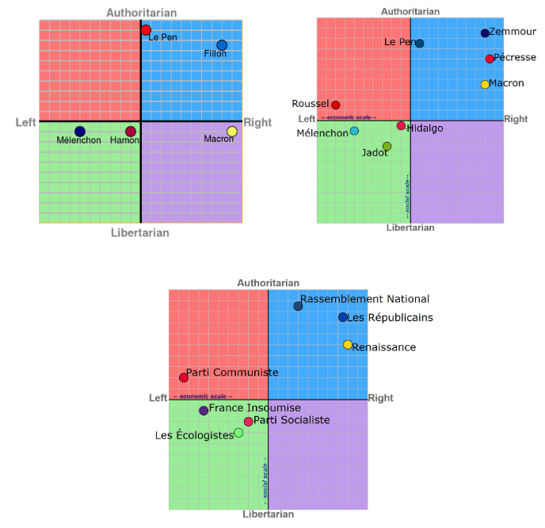

> [Accueil](../../) > [Portail philosophique](../) > Texte sur notre positionnement politique

# Texte sur notre positionnement politique

## Pourquoi écrire ce texte?

Ce texte s’inscrit dans une série abordant des points spécifiques cadrant Le Mallouestan. Comme le texte sur la liberté individuelle, le militantisme et le confort, ce sont des textes qui ont pour objectif d’aborder des incompréhensions et interprétations auxquelles nous faisons souvent face. L’intérêt est donc d’éclaircir nos positions, de les rendre accessibles et partageables. De fait, nous souhaitons que ces contenus soient utilisés de manière critique, que ce soit à l’égard de positions différentes ou, au contraire, que ces textes et leur substance soient critiqués et questionnés en tant que tels. Notre collectif a toujours valorisé la critique constructive et le questionnement extérieur, que nous voyons essentiels à la construction des différentes alternatives auxquelles nous prétendons.

Nous sommes régulièrement confrontés à des personnes cherchant à nous situer sur l’échiquier politique et notamment avec le dualisme gauche-droite. Nos positions explicitées dans nos différents textes et les valeurs que nous défendons sur place ne semblent a priori pas suffisantes pour comprendre nos intentions politiques. Nous nous retrouvons donc, régulièrement, à devoir nous justifier à cet égard en nous positionnant sur un spectre dont nous ne reconnaissons même pas le sens. Cet outil a été créé par un système<sup>1</sup> que nous rejetons de toutes parts et dans lequel, effectivement, il est difficile de nous placer. Nous ne comprenons pas, ou plutôt nous ne reconnaissons pas, la valeur de se positionner soi-même sur tel ou tel bord politique, ou de se situer soi-même sur ce spectre aurait, il nous semble, au-delà d’un exercice déclaratif, aucune garantie. Effectivement, une personne ou un groupe pourrait se dire de gauche mais, en réalité, ne pas porter les valeurs correspondantes.

## Concrètement, de quoi allons-nous parler ?

Nous allons donc, dans ce texte, expliquer pourquoi nous ne reconnaissons pas de sens à la dichotomie gauche-droite en ce qui concerne notre positionnement, et proposer d’autres grilles de lecture en nous situant à leur égard. Nous nous situerons donc sur de nombreux sujets et valeurs en montrant comment notre axiologie (les valeurs et ce que nous trouvons souhaitable) est difficilement cadrable par le dualisme ci-dessus mentionné. Comme précisé précédemment, ce texte fait partie d’un travail de notre collectif pour rendre nos positions plus accessibles et étayées. Nous nous appuierons donc dans ce texte sur de nombreuses ressources pour éviter de nous répéter mais, malgré cela, ce texte cherchera quand même à être aussi clair que possible sur les nombreux sujets et valeurs discordantes dans nos milieux.

## Le dualisme gauche-droite ?
Le dualisme gauche-droite est historiquement le prisme principal pour juger du positionnement politique et axiologique des partis politiques, des collectifs, des individus ou, plus généralement, des positions. Pourtant, il n’est pas simple de donner une définition, tout au moins d’expliquer le spectre que ces deux absolus créent. Plusieurs simplifications sont souvent utilisées, mais aucune ne semble être cohérente. La simplification extrême voudrait que la gauche soit porteuse d’égalité et la droite de liberté. Cette égalité inclurait notamment l’inclusivité, la redistribution des richesses, des droits égaux au mariage, peu importe l’orientation sexuelle, et une opposition à la valorisation des hiérarchies. Pour sa part, la liberté se caractériserait par une liberté d’entreprendre, de contractualiser, d’accumuler du capital, l’action de la méritocratie où chacun·e, au travers de sa liberté, peut entreprendre ce qu’iel souhaite, et un certain goût pour la hiérarchie. Pourtant, ce dernier point semble être contradictoire avec la liberté, et, au contraire, les valeurs anarchistes de gauche semblent mieux correspondre. Nous ne pouvons donc pas résumer la gauche et la droite à la liberté ou à l’égalité, et ce, pour de nombreuses autres raisons.

Effectivement, elle est donc souvent simplifiée autrement, où, d’un côté, ce goût de la hiérarchie est assimilé au fascisme (dans le cas de la droite), et la gauche, quant à elle, est souvent associée au communisme. Autrement dit, plus l’on tendrait vers le communisme, plus on serait de gauche, et, au contraire, plus on souhaiterait une société verticale, plus on serait de droite. Cette simplification ne réussit pas à expliquer une position centriste ni les nombreuses autres valeurs portées par ceux qui, par usage, sont considérés comme de droite ou de gauche. L’économie libérale est considérée comme de droite, pourtant la hiérarchie ne semble pas être une valeur très importante. Au contraire, des idées comme la loi du marché semblent prétendre que toustes sont égaux en potentiel. Il est effectivement difficile de comprendre le classement proche de droite entre un parti macroniste (économie libérale, pro-Europe et mondialisation, liberté individuelle) et le Rassemblement national (nationalisme, hiérarchie), malgré le saut axiologique entre eux, autrement dit l’écart de valeurs qui les sépare.

Il en va de même pour la simplification qui oppose progressisme à gauche et conservatisme à droite. Outre le populisme macroniste, autrement dit la séduction d’un électorat d’extrême droite au travers de propos d’extrême droite, il est difficile de caractériser le programme de Macron comme conservateur. En tout cas, pas dans le sens historique du terme. La vision macroniste soutient effectivement, de façon non assumée, la conservation de privilèges économiques, mais les différentes autres positions sociales ne semblent pas représenter un intérêt au-delà de l’électorat à convaincre. Effectivement, le mariage homosexuel, la transidentité ne semblent pas être des freins au projet économiquement libéral<sup>1</sup>. Nous ne cherchons pas ici à banaliser le danger que ce non-positionnement et ce conformisme à l’électorat d’extrême droite impliquent, mais à expliciter la difficulté à résumer ce dualisme à une simple opposition entre une droite conservatrice de plus en plus libérale économiquement et une extrême droite qui ne l’est pas.

L’extrême gauche agit de façon similaire en étant partiellement progressiste par conformisme électoral. Les plus progressistes, la nouvelle gauche, ne sont pas d’extrême gauche. Effectivement, l’extrême gauche et son électorat ne privilégient pas les questions progressistes, car ils ont une méfiance historique du projet libéral qui y est associé<sup>2</sup>.

Il existe pourtant d’autres modèles que celui porté par le système<sup>1</sup> actuel. Nous regrettons d’ailleurs que ces autres façons, ces autres prismes concernant le positionnement et la caractérisation politique ne soient pas plus utilisés. Par exemple, le diagramme de Nolan, que nous n’affectionnons pas particulièrement mais qui a le mérite d’être connu, ajoute une dimension à l’analyse, tout comme le fait le quadrant politique. L’exemple du diagramme de Nolan est utilisé dans ce texte surtout à titre d’illustration, car, dans nos milieux se revendiquant souvent libertariens, on pourrait s’attendre à l’utilisation d’outils issus de ces mêmes milieux. Mais de nombreuses autres méthodes existent, du diagramme de Pournelle à la carte des valeurs d’Inglehart, en passant par des modèles à trois dimensions comme la "Vosem Chart".

Pour résumer les idées de cette section, nous questionnons fortement l’utilité du dualisme gauche-droite, notamment au travers des simplifications qui lui sont associées. Dans le cas de notre vision politique, nous ne voyons pas l’intérêt de nous y positionner fallacieusement alors que nos valeurs ne s’y conforment pas, et nous regrettons que d’autres méthodes, d’autres prismes et analyses ne soient pas privilégiés. Malheureusement, comme toute simplification, ces modèles ont des faiblesses et c’est pour cela que, dans ce texte, nous essaierons d’être plus précis. Plutôt que d’utiliser trois dimensions, comme cela est le cas dans la Vosem Chart, nous nous positionnerons sur une dizaine de dualismes permettant, on l’espère, de surmonter certaines des embûches des modèles présentés.

> En 1978, le Polonais Leszek Kołakowski défendit une position à la fois conservatrice, libérale et socialiste. Il proposa une approche cohérente, une position politique fonctionnelle qui pourtant ne peut être représentée de façon appropriée au sein du dualisme gauche-droite traditionnel et illustre les faiblesses du spectre gauche-droite.



> Ci-dessus un diagramme de Nolan (https://www.politicalcompass.org/france2017) et une simplication de la Vosem Chart 

## Notre opposition à la droite

De notre expérience, au travers des questions qui nous sont posées, nous avons compris que l’importance pour la gauche (celles qui s’en réclament) est de montrer que nous ne sommes pas de droite. Commençons donc à éclaircir ce point en nous positionnant sur deux premiers dualismes.

Le premier est le degré d’intervention souhaité par l’État créant une échelle allant du totalitarisme à l’anarchisme. Au Mallouestan, nous nous opposons à l’idée de l’État, surtout sous sa forme d’État-nation. Nous en parlons et nous détaillons notre position dans le texte que nous avons écrit intitulé ```anarcho-communisme```. Nous expliquons comment et pourquoi nous nous opposons à l’État et la raison de notre choix d’inclure dans notre positionnement le terme de communisme. Nous sommes donc fermement opposés à l’intervention étatique et souhaitons un déterminisme local et territorial, comme défendu dans le municipalisme libertaire.

Ce positionnement est également un positionnement à l’égard de l’archē, autrement dit de la valorisation de la hiérarchie. Au Mallouestan, nous nous opposons à toute forme de hiérarchie arbitraire, définie comme une hiérarchie indépendante de conditions matérielles la justifiant. Quand bien même une hiérarchie est nécessaire, due à une urgence, un rapport différent au travers de responsabilités ou de conséquences différentes, elle se doit d’être la plus éphémère, la moins absolue et la plus révocable possible.

Le deuxième dualisme sur lequel nous allons nous positionner est le dualisme entre libéral et communautarisme, dans le sens politique qui désigne une approche considérant l’identité sociale comme étant largement façonnée par les relations communautaires et non individuelles. On ne parle pas de communautarisme dans le sens utilisé médiatiquement pour parler d’un repli réel ou supposé d’une communauté sur elle-même. Nous avons choisi d’aborder notre vision de l’identité notamment dans le texte sur le libéralisme (```Anti-libéralisme```).

Dans le texte, nous expliquons pourquoi nous nous opposons à la vision hégémonique de la liberté individuelle à gauche comme à droite et nous nous positionnons sur une approche communautariste (encore une fois dans le sens explicité ci-dessus) où nous pensons que l’identité, les pratiques et le choix des personnes sont façonnés majoritairement, voire exclusivement, par les différentes relations et conditions matérielles communautaires.

Ces deux positionnements suffisent normalement pour exclure toute proximité avec la droite qui, sans État, sans hiérarchie arbitraire et sans libéralisme économique, est inexistante. Autrement dit, on ne peut pas être de droite en portant ces valeurs. Cette section couvre notre position sur les trois axes du cube Vosem (AKA Vosem Chart).

## Les logiciels normatifs et le Mallouestan ?

Nous allons utiliser un troisième spectre pour aborder les sujets de la religion et de l’ésotérisme. Nous avons abordé ces sujets plus profondément dans notre texte sur la métaphysique, nommé ```Ontologie, matérialisme et ésotérisme au Mallouestan```. Ce texte aborde l’importance que nous prêtons à ces notions et leur rôle essentiel qu’elles ont dans le vivre-ensemble et l’organisation collective. Nous présentons également notre position sur un spectre entre réalisme et idéalisme, où nous nous sommes situés de façon quasi absolue du côté du premier (réalisme). Nous rejetons ainsi toute romantisation du pouvoir de la pensée et appelons à l’usage de concepts solides, ubiquitaires [partagée par toutes les partie prenantes] et cohérents.

Le quatrième dualisme est l’éternel débat entre l’acquis et l’inné. Nous rejetons fermement les deux extrêmes de ce spectre en reconnaissant l’importance de l’acquis et du constructivisme social sans pour autant exclure les propensions et tendances que les réalités biologiques créent. Nous sommes donc en désaccord avec la vision essentialiste excluant l’importance du constructivisme social, mais nous rejetons tout autant la position Tabula Rasa qui prêche un esprit humain vierge sur lequel la socialisation vient inscrire toute l’identité. Nous rejetons l’opposition exclusive de la biologie et de la sociologie en défendant une position où l’individu biologique est construit socialement avec de nombreuses prédispositions biologiques. Autrement dit, la biologie définit l’individu, mais la biologie elle-même est définie de façon importante socialement, avec certaines caractéristiques innées<sup>4</sup>.

La cinquième opposition que nous souhaitons naviguer est celle du progressisme et du conservatisme. Nous n’adhérons pas à la vision progressiste, et cela nous distingue de la gauche hégémonique. Nous ne sommes pas opposés en tant que tels à l’amélioration des conditions de vie, des rapports de domination injuste, plus généralement de l’épanouissement individuel, mais nous questionnons le coût que le progressisme de gauche et de droite est prêt à payer. Nous ne soutenons donc pas un progressisme coûte que coûte et appelons à la précaution.<sup>5</sup>

Nous ne défendons pas pour autant une approche conservatrice où les privilèges conquis sont jalousement convoités. Nous reconnaissons, pour autant, que de nouvelles approches et équilibres sociétaux nécessitent une patience et ne peuvent être bâclés. De nombreux changements proposés aujourd’hui par la gauche s’inscrivant dans cette optique progressiste le font avec une foi dans la techne, une condescendance et une prétention à l’égard de la Metis<sup>6</sup>. Cette logique hérite de la démarche moderniste ainsi que de ses défauts.

Le prochain dualisme est celui du transhumanisme et du primitivisme<sup>7</sup>. Nous explicitons notre position à l’égard de la technologie dans le texte nommé ```Antitech```, où nous explicitons les raisons de notre rejet de la technocratie et du techno-solutionnisme. De nombreux points communs sont partagés avec l’opposition précédente concernant le progressisme. Nous rejetons une approche centrée autour de la solution technologique ignorant les coûts sociétaux et écologiques qu’elle entraîne. Malgré la proximité de la position que nous explicitons dans le texte, nous nous méfions d’une position primitiviste idéalisée. Nous n’adhérons pas non plus à un primitivisme rejetant dogmatiquement les progrès et attentes sociales modernes.

Pour autant, et dans une optique d’être aussi clair-es que possible, nous rejetons un certain nombre de logiciels normatifs arbitraires. Certaines personnes le remarqueront, nous partageons ce rejet avec le projet libéral. Par logiciel normatif arbitraire, nous désignons des logiciels moraux ou politiques limitant la liberté individuelle sans fondement sociologique. Nous pouvons utiliser comme exemple les approches religieuses, notamment fondamentalistes. Nous soutenons donc la liste non exhaustive suivante :

- l’opposition à la distinction genrée des rôles sociaux ainsi qu’à la notion de féminité et de masculinité  
- nous soutenons une sexualité non bridée notamment à l’égard de l’identité du ou des partenaires (majeures)  
-

## Éthique et environnement

Le positionnement sur le prochain spectre que nous allons aborder nous diffère également de la gauche. La gauche hégémonique est plutôt relativiste morale, où tout jugement moral serait tributaire du contexte culturel ou individuel. La position à l’autre extrême de ce spectre est celui d’absolutisme moral. Le Mallouestan a une position plutôt hybride. Nous reconnaissons le pluralisme des logiciels moraux existants et reconnaissons également qu’ils sont dépendants des contextes culturels où ils sont nés. Nous rejetons également le chauvinisme occidental à l’égard de la morale dans lequel nous avons bercé. Pour autant, nous rejetons le relativisme absolu ou y tendant de certains mouvements postmodernes<sup>8</sup> qui étriquent notre capacité à appliquer une éthique à un contexte social et collectif. Autrement dit, un relativisme absolu annihilant la possibilité d’un cadrage moral collectif.

Nous pensons donc qu’il est nécessaire d’ancrer une éthique dans une forme d’absolu local. Les travaux de Quentin Meillassoux ou de Drew M. Dalton ouvrent des pistes pour réussir à surmonter la critique historique libérale de la possibilité de ces absolus. Nous pensons qu’il est souhaitable que cette éthique soit construite précautionneusement en minimisant les biais occidentaux et ne doive pas s’inscrire dans un projet universaliste [ici une volonté de le propager au monde entier] comme le fait le progressisme.

Sur le plan cosmologique [la vision des lois régissant l’univers] et de notre existence humaine en son sein, le Mallouestan adopte ici également une position particulière. Ce spectre pourrait être borné d’un côté par l’animisme où tous les êtres vivants partagent une intériorité, par exemple une âme, et que leur "physicalité", autrement dit leur corps et leurs capacités physiques, est ce qui les différencie. De l’autre côté de ce spectre se trouverait une position valorisant une intériorité bien distincte et une continuité et une homogénéité sur le plan physique, ce que Philippe Descola appellerait naturalisme. L’épistémologie<sup>9</sup> de Descola étant critiquée, nous utilisons son concept à des fins de clarté. Ce spectre pourrait être décrit également de la façon suivante : d’un côté, une volonté de valoriser une nature commune entre tous les êtres vivants (animisme) et, de l’autre, une volonté de distinction par des capacités intérieures comme l’intelligence ou la conscience.

Le premier tendrait à inclure, comme dans le Sūtra du diamant<sup>10</sup>, les animaux, les végétaux, les champignons dans ce qui est méritant d’intérêt, de par cette intériorité partagée, alors que la position inverse tend à distinguer ces catégories par une intériorité fondamentalement distincte, soit par exemple l’idée d’un "je" unique, autrement dit d’une identité singulière qui n’existerait que chez les humains. Le Mallouestan ne reconnaît pas cette notion d’intériorité, ou tout au moins la trouve trop fragile pour être utilisée comme fondement cosmologique. On ne partage donc pas d’intériorité mais plutôt une absence d’intériorité. Nous ne voyons donc pas de justification à une distinction basée sur une intériorité. Nous partageons, par contre, avec la vision naturaliste descolienne la conviction que sur le plan physique, il n’y a pas non plus de distinction à l’échelle individuelle. Autrement dit, les conditions matérielles définissant l’identité ne sont pas une disruption mais appartiennent à un plan continu partagé par toustes.

Cette idée nous amène à notre dernier dualisme, qui concerne l’inclusion ou non des autres êtres vivants dans la sphère morale. D’un côté, on pourrait citer le chauvinisme humain qui exclurait de manière absolue tout ce qui n’appartient pas à l’espèce Homo sapiens, et, de l’autre, une approche d’écologie profonde qui, ici, serait une position valorisant les valeurs intrinsèques du vivant indépendamment de son utilité pour l’humanité. Le Mallouestan se positionne plutôt du côté de l’écologie profonde en adoptant une éthique environnementale qui pourrait être caractérisée d’écocentriste. Cette position est détaillée dans le texte ```éthique environnemental``` où nous exposons notre approche qui rejette autant que possible la domestication et valorise la pérennité des écosystèmes que nous côtoyons.

## Conclusions

Les différentes positions énoncées dans ce texte ne sont pas caractéristiques de la gauche hégémonique ni de l’extrême gauche, mais, pour autant, comme nous l’avons explicité, nous rejetons fermement l’axiologie de la droite et de l’extrême droite. Nous avons montré que ce dualisme gauche-droite était questionné et questionnable. Nous sommes loin d’être les premiers à le faire. Dans ce sens, nous rejoignons la revendication de "post-gauche", terme très peu utilisé dans le monde francophone mais défendu dans le monde anglophone comme "Post-Left". Cette position est critique de la gauche, de son axiologie, et pense notamment que le gauchisme est trop centré sur le syndicalisme, l’avant-gardisme<sup>11</sup> [ici dans le sens marxiste] et le parlementarisme<sup>12</sup>, et critique par ailleurs les politiques identitaires, les tactiques militantes ainsi que les compromis faits avec le capitalisme, et que, pour toutes ces raisons, il est, de fait, obsolète.

Le mouvement de post-gauche regroupe divers courants, notamment, et de façon très représentée, l’égoïsme stirnien (que nous rejetons). Beaucoup moins représentés sont les courants primitivistes et anti-civilisationnels, et nos divers positionnements exprimés dans ce texte suffisent à clarifier notre position en permettant de comprendre notre positionnement proche des mouvances post-civilisationnelles et primitivistes. Si une telle position existe, nous serions le mieux décrits de la manière suivante :

```
anarcho-collectivist post-gauchiste rejetant les notions post-modernes
```

ou 

```
neoludith post-gauche
```

La position politique du Mallouestan est donc un mélange d’anarchisme, de communautarisme (comme défini dans ce texte), d’écologie profonde et de réalisme autant politique que philosophique (matérialisme).

## Notes

1. Système
1. Macron
2. March, Luke (2011), *Radical Left Parties in Europe* et Charles Blattberg, *Political Philosophies and Political Ideologies*
3. Sapolsky,Karaki
4. Le progressisme n’est pas simplement la recherche de progrès sociaux. Le progressisme actuel est un projet et une vision qui hérite du modernisme. Théoriquement, il est né au cours du siècle des Lumières en Europe avec l’idée que l’on peut civiliser le monde en entrant la raison et les connaissances empiriques dans les fondements de la société. C’est donc un projet colonial également. Lire Harold Mah, *Enlightenment Phantasies: Cultural Identity in France and Germany*  
5. Metis
6. Primitivisme
7. Postmodernisme
8. Epistémologie
9. Le Sūtra du diamant est l’un des sūtra les plus connus et commentés du bouddhisme mahāyāna, l’extrait pertinent : "Voici, répondit le Bouddha, comment les bodhisattvas mahasattvas maîtrisent leur esprit en méditant : quel que soit le nombre d’espèces d’êtres vivants (qu’ils soient nés d’un œuf, d’une matrice, de l’humidité ou spontanément ; qu’ils aient une forme ou non ; qu’ils aient une perception ou non ; ou que l’on ne puisse dire s’ils sont dotés d’une perception ou non), nous devons tous les conduire à l’ultime Nirvana afin qu’ils soient libérés"
10. Avant-gardisme
11. Parlementarisme