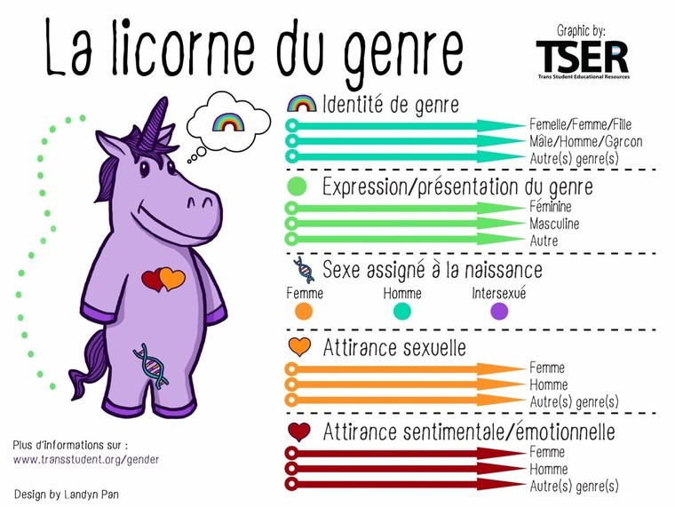

> [Accueil](../../) > [Portail philosophique](../) > Les question autour du genre

## Les questions autour du genre

### Pourquoi écrire ce texte?
Ce texte fait partie d'une série de textes répondant à des sujets spécifiques. Effectivement, à travers des échanges sur le lieu nous abordons de nombreux sujets et notamment ceux liés aux injustices et domination sociale. La question du genre apparaît donc incontournable dans ce contexte. Ces échanges ont rarement la capacité d'être à la hauteur de la complexité des sujets. Ils ont tendance à s'éterniser sur les désaccords et ces derniers, à leur tour, écrasent souvent les points d'analyse partagés par les différents interlocuteurs ou interlocutrices. 

Ce texte cherche donc à expliciter les fondements de notre vision de la question du genre. Il à plusieurs raisons d'être. Il cherche à rendre accessible et clair nos positions dans une optique de partage et de transmission mais également dans une optique de remise en question et de critique permanente. Effectivement, le collectif valorise les échanges se voulant constructif avec comme objectif de questionner nos positions. Notre vision et idées rendu accessible par ce texte sont également rendu abordable et critiquable.

### Quels sont les enjeux de cette question?
Le genre, malheureusement et nous verrons pourquoi dans ce texte, est un des blocs majeurs de notre construction sociale. Il structure, parmi d'autres stéréotypes, nos comportements quotidiens ainsi que la façon dont nous appréhendons et comprenons les comportements d'autrui. La question du genre est donc un sujet qui nous concerne touste à des niveaux et des façons différentes pouvant être liés à d'autres réalités sociales. Le genre structure parmi d'autres nos situations économique, familiale, relationnelle ou professionnelle. L'importance et la centralité du genre est une des raisons qu'il y a autant d'échanges, de débats et de confrontations sur ce sujet. 

Ce sujet est d'autant plus important qu'il est utilisé dans de nombreux rapports de domination (sexiste, patriarcal, transphobe ...) que ce soit à l'égard des personnes considérées comme femme ou dans les nombreuses discriminations à l'égard des personnes considéré comme trans (nous reviendrons sur la définition). Ces dominations et discriminations autant arbitraires qu'injustifiées doivent être décriées et abolies. La question de comment ainsi que la question de quelle stratégie mettre en place pour arriver à ces fins est source de nombreux désaccords. 

Comme nous l'avons déjà dit ce sujet est complexe et doit être simplifié avec précaution. Les personnes les plus concernées cherchent tant bien que mal à faire valoir leur vision et leur vécu. Les milieux militants, académiques et autres font face depuis plus de 30 ans à différentes écoles de pensée qui, et comme la "gauche" sait si bien le faire, se battent souvent entre elles.  Certaines de ces approches, nous allons nous y attarder dans ce texte, sont compatibles avec la culture dominante; d'autres exigent, peut-être à juste titre, des changements profonds et rapides de nos habitudes et logique sociale. Il faut également souligner l'intêret pour les dominants bénéficiant de cette vision genré de maintenir celle-ci. Il nous semble donc que ce sujet figure parmi la liste de ceux sur lequel il est important de se positionner.

### Comment définir le genre?
C'est là où les choses se compliquent : il existe de nombreuses manières de définir le genre. Contrairement à ce que l'on peut parfois entendre, ce n'est pas une évidence avec une définition consensuelle [accepté par toutes et tous]. Divers groupes défendent diverses approches, malgré parfois de fortes proximités politiques. Nous allons nous concentrer sur les approches présentes dans les milieux se réclamant de gauche. Nous ne prétendons pas que les différentes approches que nous allons présenter sont exclusives. Au contraire, elles permettent d'esquisser un spectre sur lequel sont représentés les divers avis et visions.

#### La binarité des genres

Avant de commencer, il faut expliquer le principe de binarité de genre. La binarité de genre est l'approche culturelle et sociale majoritaire où le genre n'existe que comme homme ou femme. Autrement dit cette vision soutient qu'il y a donc deux genres soit homme ou femme. Majoritairement, cette approche défend que ce qui définit son genre (si on est homme ou femme) est le sexe biologique. Cette vision binaire associe des comportements, dits normaux, à chaque catégorie comme par exemple le fait d'être rationnel, affirmé ou fort pour les homme et empatique, discrète ou douce pour les femmes. Cette vision crée une culture ou il est mal vu de transgresser, soit le fait de ne pas respecter ces catégories.

La mannifestation phisique de ce sexe biologique est vue dans cette approche comme simple indicateur d'une nature comportementale ou d'une nature capacitaire. Il est important de noter que à ce jour qu'il n'existe aucune preuves scientifiques, sociologiques ou psychologiques justifiant les catégories telles qu'elle ni un interet partagé à les maintenirs en place. Au contraire il semblerait qu'il faudrait expérimenter de nouvelles approches en vue des attentes sociales défendus aujourd'hui.

#### L'approche libérale
La binarité des genres est un concept essentiel pour aborder notre première approche, que nous allons décrire comme libérale. C'est une vision très répandue dans les milieux militants et queers. Le genre, dans cette approche, est avant tout un ressenti (identitaire, profond, sentimentale, rôle social, etc), quel qu'il soit, du moment qu'il concerne les comportements que la binarité des genres encadre. Autrement dit le genre ne dépend plus de son corps ou de sa biologie mais d'un ressenti. L'approche libérale valorise donc ce ressenti individuel, qui ne doit pas être, selon cette approche, limité par un cadre binaire arbitraire. Vu ainsi, être femme veut dire se sentir femme. Plus généralement être de tel ou tel genre veut dire se ressentir de ce genre. Cette vision défend la possibilité de ne pas se ressentir représenté-e ni par les genres femme ou homme et être non-binaire.

> Ci-dessus "La licorne du genre" régulièrement utilisée pour illustrer l'approche libérale

Cette vision se centre donc, comme on le voit sur le schéma également, sur l'individu, son expérience personnelle et son ressenti. Le genre est donc vu comme une identité cherchant à mieux décrire le ressenti et le vécu des personnes concernées, au-delà et à la place de la binarité par défaut. Cette identité est vue comme une clé pour l'émancipation individuelle et est souvent considérée comme une façon de découvrir ou de comprendre le "vrai soi".1 Cette approche défend que chaque personne peut exprimer son genre, quel qu'il soit, comme iel le souhaite, ainsi que définir ce que ce genre implique au niveau des interactions sociales (par exemple, le langage, l'inclusivité, etc.). 

Le genre est vu comme muable [pas fixe et qui peut changer] et peut évoluer au cours de la vie ou de la journée. L'émancipation individuelle défendue cherche à permettre à chacun et chacune d'être accepté·e comme iel est et ainsi d'être traité·e juridiquement et socialement comme toute autre personne. C'est une vision centrée sur la liberté individuelle, s'opposant au fait que les cadres normatifs (notamment la binarité des genres) limite cette liberté et repose sur une foi dans le résultat que cette liberté permet. C'est pour cela que cette approche est considérée comme libérale.

Nat Raha, dans son article sur les limites du « translibéralisme »2, partage les dangers d'une telle approche, expliquant qu'une telle émancipation individuelle ne remet pas en cause d'autres problèmes structurels de la société et même parfois les accentue. Nat Raha démontre comment cette réalisation individuelle est tout à fait compatible avec le capitalisme. Cette critique est courante et partage de nombreux points avec la notion d'homonationalisme3 développée par K. Jasbir. Par ailleurs, Nat Raha, Judith Butler, Juliette Jacques, Pauline Clochec et de nombreux·euses autres penseur·euses expliquent qu'en se concentrant ainsi sur l'individu, on abstrait le contexte politique et social, que l'on finit par oublier en faveur de l'individu4.

#### L'approche semi-libérale
Cette dépolitisation, ou plutôt l'impossibilité de politiser l'individu seul, pousse, dans une autre approche, de nombreuses personnes à considérer l'individu et son ressenti dans le contexte plus large du social et du culturel. Le genre reste majoritairement un ressenti, un vécu ou une expérience personnelle, et se manifeste également de façon identitaire5. Cependant, cette identité et ce vécu sont aussi vu comme façonnés par le contexte social. Il en va de même pour l'expression du genre ou les revendications identitaires, qui sont vues comme des comportements dépassant l'échelle individuelle, ayant de fait une ampleur sociale.

Dans cette approche, le genre est une identité au moins partiellement partagée entre un groupe d'individus revendiquant des droits et cherchant une émancipation. Cette approche hybride est parfois critiquée, d'un côté comme prenant le risque de perdre l'individu de vue, mais surtout d'un autre côté comme n'étant pas cohérente ou suffisamment "jusqu'au-boutiste". Effectivement, cette critique questionne pourquoi maintenir la centralité de la subjectivité tout en intégrant une contextualisation sociale. Cette critique voit plutôt une analyse centrée autour de dynamiques structurelles et sociales où l'individu est symptôme plutôt qu'acteur. La notion de symptôme peut sembler péjorative, mais elle n'a aucunement cette intention. Cette notion est utilisée ici pour expliquer que l'individu, son ressenti et son expérience sont vue comme dépendant/conséquence d'un contexte social et culturel6. De fait, il n'est pas question d'ignorer le vécu ou le rôle des différents individus, mais de les inclure dans une analyse plus globale.

#### Approche matérialiste
Pour ces raisons, une autre grande famille d'approches est défendue : celle des approches matérialistes. Ces approches cherchent à définir le genre sur des réalités sociales et culturelles. Certains penseurs et penseuses essaient de définir le genre comme étant basé sur l'oppression vécue7, certes influencée mais pas dépendante du ressenti de l'individu. D'autres définissent le genre comme issu de la binarité des genres mais, contrairement à celle-ci, cherchent à dépasser ces catégories et, de fait, à dépasser le genre.

C'est le cas de Pauline Clochec, citée précédemment, mais aussi de nombreux autres penseurs et penseuses qui se concentrent sur la transgression de la binarité des genres, comme le fait Monique Wittig quand elle dit : "Les lesbiennes ne sont pas des femmes"8. Ce qu'elle entend par là est que la notion de femme définie par le système hétérosexiste est dépassée par les personnes lesbiennes, car elles se soustraient à l'injonction hétérosexuelle promue par le patriarcat. Dans la même idée, Pauline Clochec définit le genre comme l'oppression cis-hétéro-patriarcale et la transitude comme sa transgression9.

Pauline Clochec invite à appréhender la transitude dans son « effectivité » plutôt qu'en tant que vécu. Dans son livre "Après l'identité : transitude & féminisme", elle appelle à lutter collectivement contre le contrôle patriarcal, qu'elle considère comme l'ennemi des femmes et des personnes qui transgressent la binarité des genres. Elle justifie notamment sa critique des revendications identitaires libérales par le fait que « l’assignation » sexuelle apposée par autrui découle fondamentalement de la binarité des genres et non du ressenti, quel qu'il soit, de l'individu. Pour elle, malgré les revendications, une personne qui transgresse la vision binaire du genre se trouve, malgré elle, intégrée à une « classe de sexe » binaire. Elle rejoint ici les travaux d'Emmanuel Baubatie qui, à travers son analyse de la mobilité sociale appliquée au genre, présente l'asymétrie des oppressions vécues en fonction de la nature du « transfuge de genre »6. Autrement dit, une personne ne correspondant pas aux stéréotypes binaires sera traitée différemment selon qu'elle est assimilable davantage à une femme ou à un homme. Clochec appelle à « ne plus penser le genre comme une propriété individuelle, mais comme un rapport social », ce qui, pour elle, implique un ralliement aux luttes féministes opposées au système patriarcal.

Nous avons donc couvert un large spectre d'approches s'opposant à la binarité des genres. Nous avons présenté l'approche libérale ainsi que l'approche matérialiste, en expliquant que l'espace intermédiaire est celui le plus souvent occupé. Autrement dit, la majorité des projets politiques sur la question du genre se situe entre l'approche libérale et l'approche matérialiste.

### Concrètement, comment se manifeste cette question au Mallouestan?

Au Mallouestan, nous nous inscrivons dans cette perspective matérialiste que nous venons d'exposer. Nous partageons les nombreuses critiques à l'égard de l'approche libérale, notamment ses penchants dépolitisants, sa compatibilité avec le capitalisme et sa tendance à alimenter d'autres dominations. Notre vision est également structurée par une conception de la transgression de la binarité des genres. Nous rejoignons aussi Judith Butler, qui affirme, en parlant du genre, que celui-ci n'est pas « une identité stable ou le lieu d’une agentivité depuis laquelle partent des actes variés ; il s’agit plutôt d’une identité ténue, constituée dans le temps – une identité instituée à travers la répétition stylisée d’actes ». Nous souscrivons également à sa position lorsqu'elle déclare que « en tant que performance performative, le genre est un “acte”, au sens large, qui construit la fiction sociale de sa propre intériorité psychologique ». Ces éléments sont essentiels pour comprendre la vision défendue par le Mallouestan.

Comme nous l'avons vu ci-dessus, le genre est une oppression. Même si cette définition n'est pas universellement partagée, nous pouvons nous accorder sur le fait que le genre est utilisé comme outil d'oppression, tout comme les notions de féminité et de masculinité. Si l’on suit la définition de Butler, selon laquelle le genre, au niveau individuel, est une assignation sociale découlant de comportements ponctuels répétés, si nous prenons également en compte la vision matérialiste affirmant que cette assignation ne peut s'abstraire de la binarité des genres, et que le genre dans l'approche libérale serait, comme Butler le présente, éphémère et dépendant de l'acceptation d'autrui, nous concluons à la nécessité de l’abolition du genre.

Nous nous opposons donc à la binarité des genres et, de ce fait, comme le définit notamment Pauline Clochec, nous nous opposons au genre. Cette binarité, que l'on rejette, repose sur les notions d’une nature propre aux femmes et aux hommes, respectivement la féminité et la masculinité. Il nous semble que la racine du problème de la domination à l'égard des femmes et des personnes trans repose dans ces fictions, imaginaires ou stéréotypes. Nous rejetons ainsi ces idées de féminité et de masculinité, que ce soit dans la question du genre ou lorsqu'elles sont invoquées dans certains courants écoféministes par exemple.

Au Mallouestan, nous défendons donc un agenrisme. Par cela, nous entendons une volonté de nous abstraire de la binarité des genres au quotidien, dans le cadre du lieu. Autrement dit, nous cherchons à créer un contexte où le genre , la notion de féminité ou de masculinité n'existe pas. Ce projet agenre englobe les interactions sociales, l'organisation collective, les comportements et les analyses politiques. Nous souhaitons dégenrer le langage en éliminant les distinctions arbitraires créées par la binarité.

> Cette opposition aux genres implique une opposition politique et idéologique aux genres que certaines personnes trans peuvent revendiquer. Effectivement une personne trans s'identifiant comme homme-trans, par exemple, utilise la binarité et/ou des genres. Notre opposition  de la vision libéral est donc idéologique et non un rejet, un jugement péjoratif, ou une antagonisation des individus ou plus largement des personnes qui y soucrivent. Notre désacord ne change rien à notre opposition radicale à toute discrimination faite sur cette base idéologique ou toute discrimination de genre.   

Nous ne prétendons toutefois pas que cette simple volonté suffise à éradiquer le problème structurel de la binarité des genres ou du traitement diférencié en fonction du genre perçu. Nous savons que, en raison de notre socialisation, il est difficile, voire impossible, de réussir à déconstruire totalement ces normes. Pour cette raison, entre autres, nous ne souhaitons pas ignorer, dans une approche analytique et descriptive, les injustices et les asymétries qu’elles génèrent. Notre projet agenre ne cherche donc pas à éliminer complètement ces notions dans ces contextes descriptifs, mais bien dans nos interactions quotidiennes.

Ce projet se heurte malheureusement à nos autres ambitions et à notre volonté d'inclusivité. Nous accueillons parfois des personnes qui, très éloignées de ces réalités, ne peuvent se conformer à ce projet. Nous acceptons donc qu'il soit nécessaire, dans certains cas, d’échanger dans des contextes "dégradés"10 dans une optique d’inclusivité. Nous souhaitons ainsi instaurer cette approche agenre pour les personnes vivant sur place, mais sans imposer la même exigence aux visiteurs.

### Conclusion

Nous avons, dans ce texte, exprimé notre opposition fondamentale aux oppressions et aux distinctions arbitraires résultant d’une non-conformité au genre perçue ou liée à une assignation au genre féminin. Nous avons esquissé notre compréhension des différentes approches du genre en présentant l’approche libérale, ainsi que des alternatives et des critiques qui les justifient. Nous avons expliqué la position du Mallouestan, qui vise à abolir la binarité des genres et les notions de féminité et de masculinité qui, selon nous, les sous-tendent.

Nous avons également détaillé notre volonté d’abolir tout genre en demandant aux personnes vivant sur place d’adopter une organisation et des interactions sociales aussi agenrées que possible, tout en reconnaissant que nous ne pouvons pas avoir la même exigence aux personnes visitant le lieu.

### Notes et références

1. "Ce corps n'était pas le mien" de Béatrice Denaes, "Olivier Delacroix : Transidentité, le combat pour être soi" https://www.youtube.com/watch?v=um-1IVWzd8E, "Transidentité: Être Soi-Même" https://www.youtube.com/watch?v=rp0KPcUWP3c, "Becoming Who We Are: Real Stories About Growing Up Trans" de Sammy Lisel, "Trans Anthology Project: Reflections of Self-Discovery and Acceptance Paperback" de Heather H Kirby
2. https://www.versobooks.com/blogs/news/2245-the-limits-of-trans-liberalism-by-nat-raha
3. K. Jasbir Puar: Homonationalisme. Politiques queers après le 11 septembre 
4. "Matérialismes trans" aux éditions Hysteriques & Associées
5. Cette vidéo de Et tout le monde s'en fout sur le genre montre bien ce saut constant entre constructivisme sociale et identité/libre arbitre/soi même https://www.youtube.com/watch?v=_AjgWaWz7dU
6. "Transfuges de sexe" de Emmanuel Beaubatie
7. "Trans Identities and First-Person Authority" de Talia Mae Bettcher et Talia Mae Bettcher dans "Histories of the Transgender Child"
8. "La Pensée straight" de Monique Wittig
9. "Après l'identité : transitude & féminisme" de Pauline Clochec
10. Nous voulons par défaut parler en neutre. Dans le cas ou le neutre n'est pas compris et de fait inclusif nous accepterons de passer en langage inclusif faisant apparaitre des genres mais en veillant leurs representations égal.