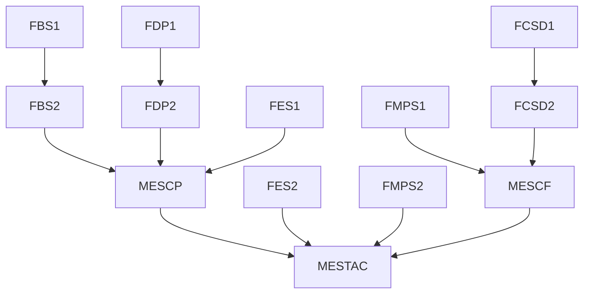

# Formations et sessions

## Présentation
Le Mallouestan organise plusieurs formations pour partager les compétences du lieu.

## Liste de formations 
- FBS: Bushcraft et Survie
- FDP: Déplacement et Parkour
- FES: Escalade et Scrambling
- FMP: Medic et premiers secours
- FCS: Combat et Self-defence

## Liste de sessions
- PPM: Préparation physique et mentale
- MESCP: Mise en situation course poursuite
- MESCF: Mise en situation capture the flag
- MESTAC: Mise en situation tactique 

## Arborescence des prérequis 
Les formations sont décomposés en plusieurs niveaux avec des prérequis comme explicités ci dessous.

