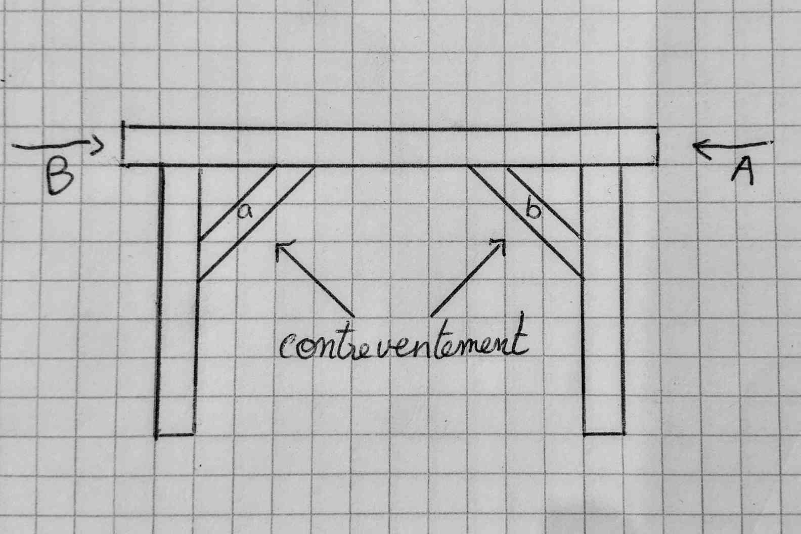
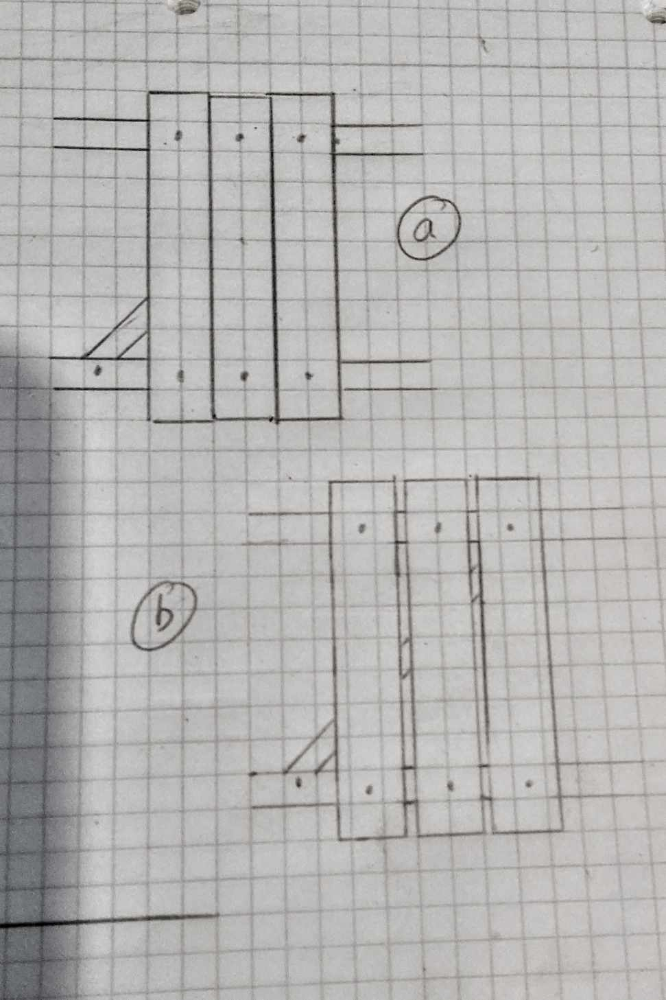
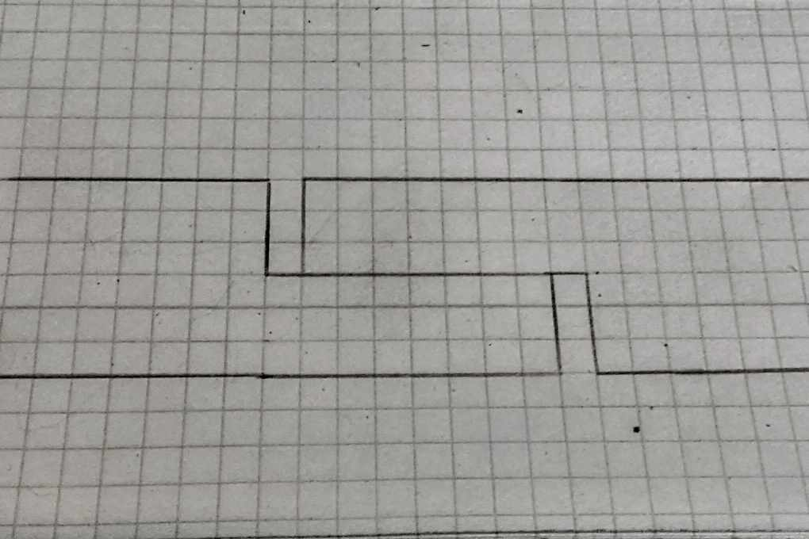
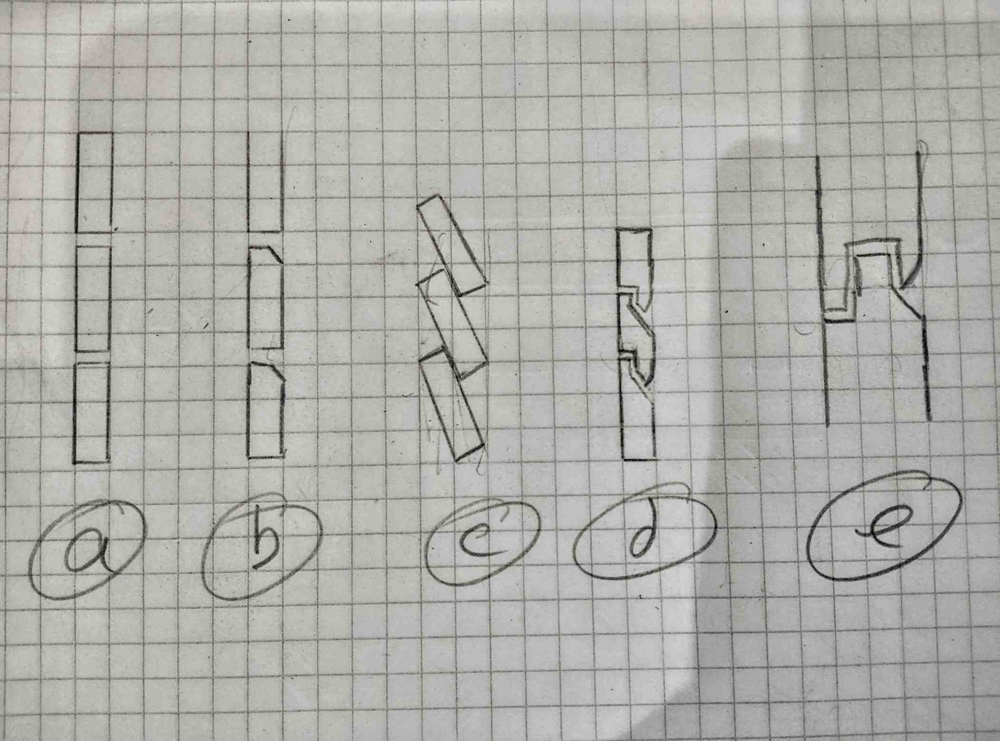

## Analyse préliminaire lors d'une construction

Avant de commencer un projet ou une construction une première analyse est nécessaire pour identifier diffénts risques et contraintes ausquels la construction seras soumises et auquel il faudras pallier. 

### Forces
#### Verticale

La majorité des structures sont exposées à des forces verticales, au minimum à la gravité. Dans le cas d'une maison, d'une table ou d'une brouette, une charge dite normale exerce aussi de nombreuses forces.

Ces forces verticales sont souvent les plus importantes et impliquent des logiques de constructions. Nous priviligierons donc, par exemple, des pièces verticales surlequels se reposent les horizontales. Dans le cas ci-dessous nous priviligierons l'assemblage de gauche.

Il peut arriver que celui de droite soit incontournable nous chercherons donc a maximiser la section (surface) porteuse (soutenant la charge) du poteau comme dans le cas de l'assemblage tenon mortaise si dessous:

Un rebord est donc laissé pour que toute la largeur du poteau prennent la charge ainsi que toute la section horizontale et pas simplement le tennon, qui lui est souvent inférieur à un tier de la section 

#### Ventement et horizontales

Les grandes structures sont exposées au vent ou à des forces horizontales internes (par exemple un meuble ou une personne s'appuyant contre une paroi ou un mur). Ces forces sont horizontales et doivent être prisent en compte. Le triangle étant une forme très resistante à la déformation ils sont souvent créer, via des diagonales, pour solidifier une structure rectangulaire. En charpente ces diagonales sont parfois appelé bielle de contreventement. 

La bielle (a), dans le cas de tenon mortaise, sert principalement à protéger la structure de la force A et (b) de la force (b). Le therme bielle implique que (a) et (b) fonctionnent principalement un rôle en compression. Si (a) et (b) sont fixer de façon a aussi fonctionné en tension alors (a) et (b) agissent cojoitement contre les forces A et B.

Les plaques (OSB, contreplaqués ...) ou de tôles (ondulés, bac acier) solidifient grandement la déformations de structures car elle agisent en tant que contreventement car elle sont rigides sous tensions. Sous compression elles ont tendances à se plier où bomber. 

#### Neige et pluie

Les matériaux trempé ou soutenant de la neige expose la structure à des forces anormales. Il est important de les considérer. Dans le cas d'une toiture de la neige fraiche pèse entre 30 et 50kg au mètre cube et peut peser jusqu'à 400kg quand elle est humide ou/et plus compacte. Dans le cas de 20cm de neige sur une toiture cela peut impliqué facilement 50 à 80 kg de neige par m2. Pour une toit de 5m de large et 8m de long cela ajoute 2 tonnes à la structure.

#### Coeficient de sécurité

Une fois les différentes charges normales considérer et les charges anormales "évidentes" il est préférable d'ajouter un coefficient de sécurité pour se protéger de "surprises". Souvent nous utilisions 1,5.

#### Forces asymétriques et moments

Dans le schéma si dessus f2 est une force qui seras propagée de façon particulière dans la structure. Imaginer une personne assis sur le bout d'un banc amenant l'autre extrémité à se soulever. La force f2 indirectement "soulève" le bord de gauche. Dans le cas ou f2 est envisagée conséquente il est important de le contrer parfois à l'opposé de la structure.

### Déformation et variations des matériaux

Avec les variations de chaleur et d'humidité les matériaux quels qu'il soit change de propriétés nottement de taille. Cela peut mener a des déformations importantes si ce n'est pas pris en compte. Parquet, lambris ou plan de travail qui bombent parfois jusqu'as rompre.  La figure (a) dans le schéma si dessous ne permet pas aux planches de changer de taille alors que la figure (b) prévoit un peu de place. 

La figure (b) prévoit certe de la place mais ne convient pas dans toute situation le schéma si dessus permet au matériaux de changer de taille tout en éliminant les espaces. 

### Eau et humidité
#### Pluies

Quand nous considéront la pluie il faut prendre plusieurs facteurs en compte.

La figure (a) ci-dessus as des risques d'infiltration car le moindre écart permet à la l'eau de s'accumuler sur les tranches des planches.

La figure (b) évite ce problème avec le chanfrin mais reste vulnérable au vent pouvant chasser l'eau horizontalement de droite (l'extérieur) vers la gauche (intérieur).

La figure (c) coutourne les deux problème mais utilise plus de matière que d'autres solutions (donc plus lourd). Elle est également plus compliqué à sécuriser aux extrémités. Elle à l'avantage d'être simple a mettre en oeuvre.

La figure (d) est très efficace et est plus simple que la solution (e) qui est encore plus sécurisant.

La pluie est un élément qui ne doit pas être négligée une logique similaire à celle qui soutend (c) doit être envisagé sur tout le batis. Autrement dit un chevauchement verticale de la piece de haut par dessus celle directement en dessous est conseillée pour les élements au contact de la pluies.

#### Inondations
Les inondations doivent être considérées pour différentes raisons. Les dégats dût à l'eau et la boue ainsi qu'aux débris véhiculé ainsi que les forces auquels elles exposent la structure.

Des pilotis peuvent être considérer mais doivent supporter les forces. La meilleur solutions est de bien choisir l'emplacement ou de terrasser.

#### Capillarité 
L'eau à tendances de remonter par capilarité dans de nombreux matériaux. S'infiltrant ainsi dans les murs ou poteaux touchant le sol. Un hérisson, des murs en pierre sèche ou un matériaux imperméable permet d'éviter se phénomène. 

#### Humidité et isolation

L'humidité et l'isolation sont fondamentales dans les espaces de vie mais aussi d'autres structures (four solaire, séchoire, placard de stockage). L'humidité affecte les matériaux et la chaleur est parfois importante à conserver ou évacuer.

L'air chaux monte et entraine un courant avec lui. Nous pouvons utiliser ce principe pour mieux chauffer un espace mais aussi pour évacuer l'humidité. Il est donc conseillé de créer une sortie d'aeration en hauteur et une entrée basse et à "l'opposé" de la structure comme sur le schéma ci-dessous.

SCHEMA NECESSAIRE

Il faut analyser et prevoir la circulation d'air dans une structure. Un placard à besoin d'évacuer l'humidité tout comme une pièce de vie. Penser à laisser de l'espace pour que circule entre les étagère peut être en alternant l'avant et l'arriere pour que l'air circule dans l'enssemble de la structure ne doit pas être sous estimée.

### Parasitage et nuisibles
#### Exclusions de certaines espèces

De nombreuses espèces aime hacker [utiliser a des fins non prévue à l'origine] les constructions humaines. Il faut considérer les dégats qu'iels peuvent causer sans pour autant les exlure par défaut de nos environments proche. Essayons de composer avec elleux. Malgré celà il faut considérer les risques qu'elle posent. 

Cela peut être des rongeur creusant des trous dans les murs ou, comme leur nom sous entend, qui peuvent ronger des éléments structurels. Des oiseaux fabriquant des nids hautement inflamable ou bouchant un conduit d'aération. 

Ces risques sont propres aux espèces sauvages de l'environnment où la structure s'inscrit. Il faut une certaines analyse de cet environmment. 

#### Dégradation des matériaux
De nombreux insectes, d'autres espèces ou des champignons peuvent dégrader des matériaux. Un choix de matériaux doit également se faire en considérant ces réalités. 

### Autres risques
#### Feu et incendie

Le feu est un danger considérable pour de nombreuses structure. Le feu peut se transmettre même par simple radiations (à distance) et ne doit pas être sous estimée.

Des matériaux ignifuge comme la pierre, la briques, les tommettes ou la terre paille peuvent créer des espaces de sécurité.

#### Affaissement, fondations et terrain

Le terrain surlequel se repose une structure peut ne pas être stables et exposer la structure à diverses forces extrème auquel lutter est presque vain. Il faut plûtot aborder cette problématique avec de la prévention. Le choix d'emplacement est important mais également une sécurité qui solidifie la structure en cas de glissement ou d'affaissement. Une structure peut servir même de cage protectrice. 