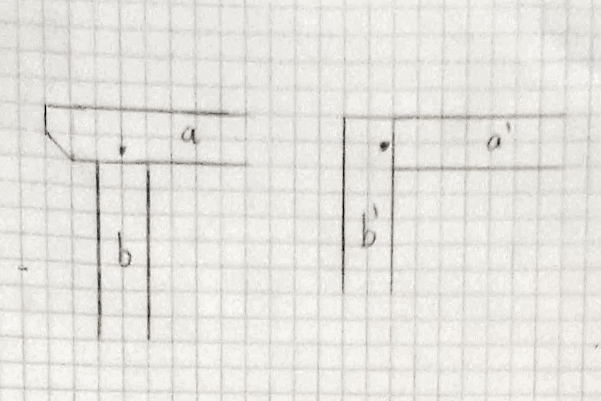
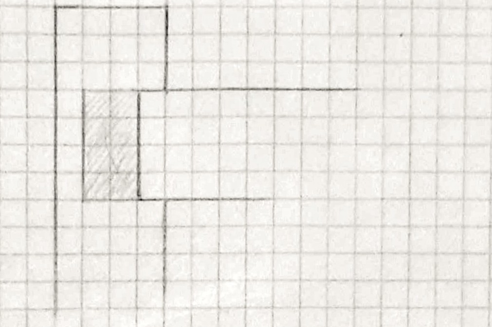
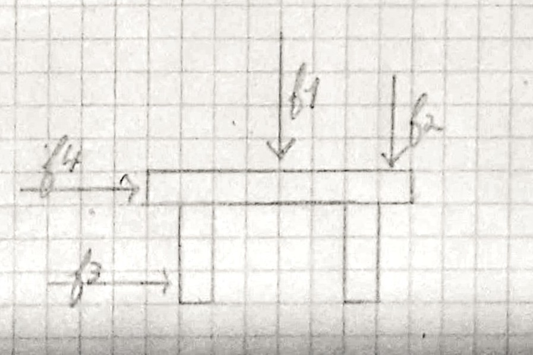

> [Accueil](../../) > [Portail technique](../) > [Portail construction](./) > Analyse préliminaire lors d'une construction

## Analyse préliminaire lors d'une construction

Avant de commencer un projet ou une construction une première analyse est nécessaire pour identifier diffénts risques et contraintes ausquels la construction seras soumises. 

### Forces

#### Verticale

#### Ventement et horizontales

#### Neige et pluie

### Déformation et variations des matériaux

### Eau et humidité

#### Pluies

#### Inondations

#### Capillarité 

### Parasitage et nuisibles

#### Exclusions de certaines espèces

#### Dégradation des matériaux

### Autres risques

#### Feu et incendie

#### Affaissement, fondations et terrain