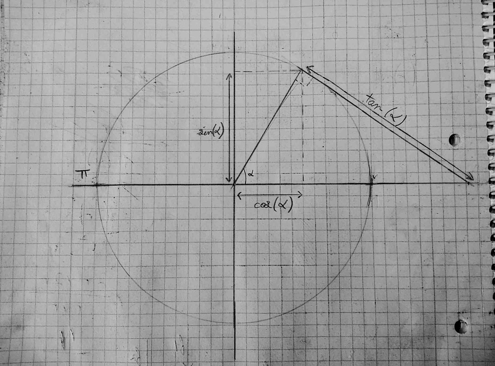

> [Accueil](../../) > [Portail technique](../) > [Portail construction](./) > Bases de trigonométrie

## Bases de trigonométrie

Sur le cercle, dit trigonométrique, ci-dessus apparait le cosinus, le sinus et la tangeante pour un angle donné (sur le schema environ 60 degré). Pour tout angle une paire unique de valeurs de sin, de cos existe. Gràce à ces valeurs nous pouvons faire l'opération inverse et trouver l'angle. L'angle forme un triangle qui à de coté la valeur du sinus et celui du cosinus ainsi qu'un hypthénuse égale au rayon du cercle içi 1. Grace au sinus et cosinus nous pouvons trouver les angles ou les longueurs des cotés d'un triangle sans connaitre les 2 cotés nécessaire pour la résolution avec pythagore.