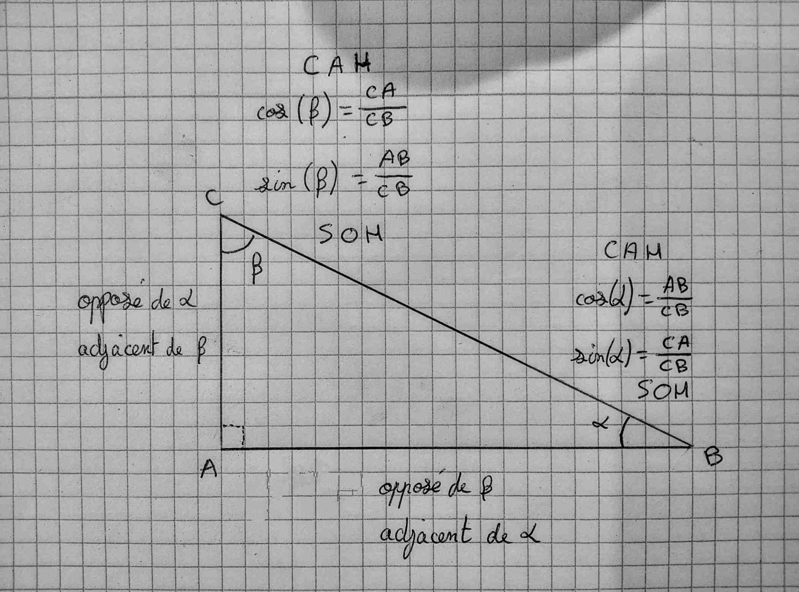
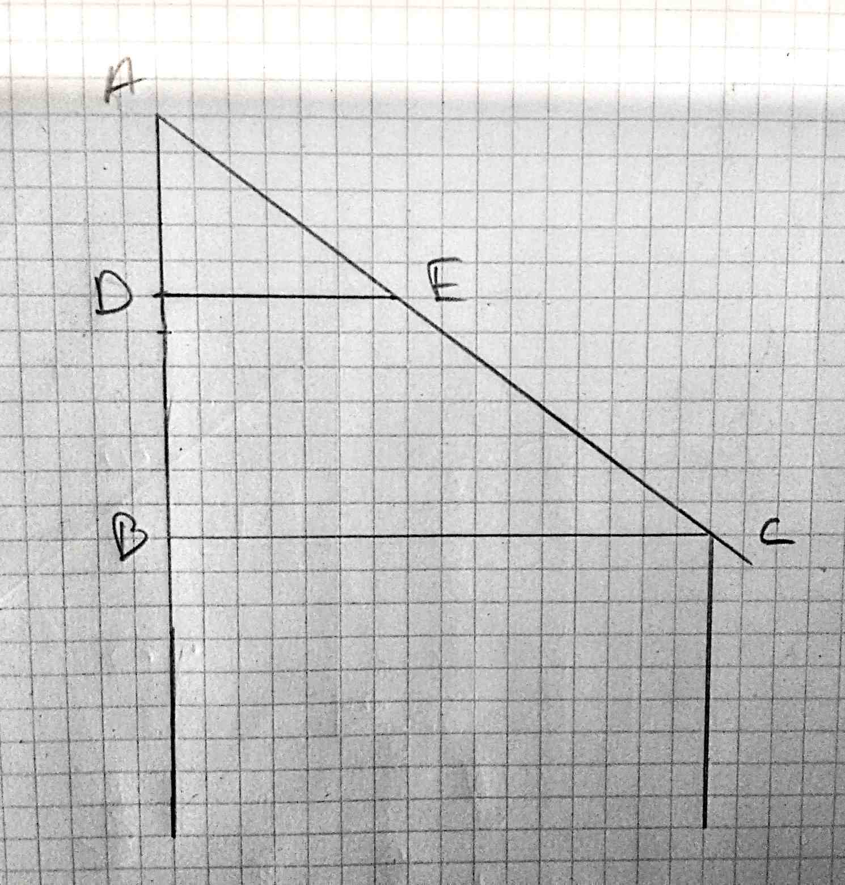

> [Accueil](../../) > [Portail technique](../) > [Portail construction](./) > Bases de trigonométrie

## Bases de trigonométrie


Sur le cercle, dit trigonométrique, ci-dessus apparait le cosinus, le sinus et la tangeante pour un angle donné (sur le schema environ 60 degré). Pour tout angle une paire unique de valeurs de sin, de cos existe. Gràce à ces valeurs nous pouvons faire l'opération inverse et trouver l'angle. L'angle forme un triangle qui à de coté la valeur du sinus et celui du cosinus ainsi qu'un hypthénuse égale au rayon du cercle içi 1. Grace au sinus et cosinus nous pouvons donc trouver les angles ou les longueurs des cotés d'un triangle sans connaitre les 2 cotés nécessaire à la résolution avec pythagore.

### Dans un triangle

Un moyen mémotechnique permet d'appliquer plus simplement a trigonométrie, c'est le fameux **SOHCAHTOA** qui permet de se rappeler que dans un triangle 

```
SOH -> sin(angle)=coté-opposé/hypothénuse
CAH -> sin(angle)=coté-adjacent/hypothénuse
TOA -> sin(angle)=coté-opposé/coté-adjacent
```



### Fonctions et fonctions inverses

Les fonctions mathématiques permetent d'obtenir ces différentes distances: sin(angle), cos(angle), tan(angle).

Des fonctions permettent de faire l'opération inverse et ainsi de fournir l'angle à partir de la longueur: sin<sup>-1</sup>(longueur), cos<sup>-1</sup>(distance),tan<sup>-1</sup>(distance).

> Ces fonctons inverse sont parfois noter asin, acos, atan ou arcsin, arccos,arctan.

### Cas d'usage

Prennons quelques exemples:



Cherchons l'angle du toit de l'abbris çi dessus soit BĈA sur le schéma ci-dessus.

```
Calculons l'hypothénuse (AC) avec Pythagore
AC² = AB²+BC² = 3²+4² = 25
AC = √25 = 5

Au tour de la trigo
sin(BĈA)=coté-opposé/hypothénuse=AB/AC
sin(BĈA)=3/5
BĈA=asin(3/5)
BĈA=36.87 degrés
```

Maintenant remplaçons le toit pour le remplacer par un toit en chaume nécessitant un angle plus grand, disons 60 degrées. Nous interressons donc a l'incidence sur la longueur AB


Si BĈA est égale 60 degrés et nous savons que 

```
tan(BĈA)=AB/BC
```

Nous nous intéressons à AB nous pouvons multiplier des deux coté par AC et obtenons:

```
tan(BĈA)xBC=AB
```

soit 

```
AB = tan(BĈA)xBC
AB = 4 x tan(60 degrés)
AB = 4 x 1,732
AB = 6,928
```

Avec un angle de 60 degrés la hauteur de l'abbris augmente de 3,928m car:

```
6,928(nouvelle hauteur) - 3(ancienne hauteur) = 3,928m
```


