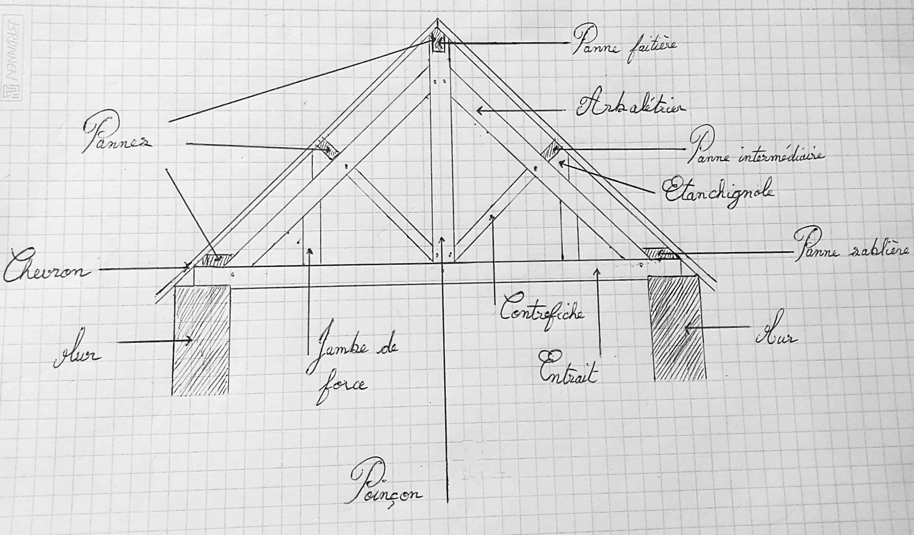

> [Accueil](../../) > [Portail technique](../) > [Portail construction](./) > Vocabulaire de charpente

## Vocabulaire charpente

- **Arbalétrier :** Les arbalétriers sont des grosses pièces de bois aux extrémités de la charpente qui forme le triangle. Ils donnent l’inclinaison, la pente du toit. Ils maintiennent et supportent la couverture et reçoivent les pannes et échantignoles.
- **Arêtier :** L’arêtier est une pièce de charpente qui forme l’angle saillant d’un toit ou l’arête d’intersection de deux versants de toiture. Il rend les deux versants du toit étanches. L’arêtier est l’inverse de la noue.
- **Assainissement :** Assainissement ou traitement de charpente. Toutes les charpentes ont besoin d’être traitées pour éliminer les insectes qui vivent et se nourrissent du bois de charpente, comme les capricornes, vrillettes, lyctus…
- **Bastaing :** Un bastaing est une pièce de bois rectangulaire utilisée pour la structure de la charpente comme solivage. Il a une épaisseur entre 55 et 65 millimètres et une largeur entre 155 et 185 millimètres.
- **Charpente :** Une charpente est un assemblage de pièces de bois ou de métal, servant d’ossature pour soutenir ou couvrir des constructions et faisant partie de la toiture.
- **Cheneau :** Un chéneau est un conduit métallique posé à la bordure de la toiture pour recueillir l’eau de pluie et l’évacuer dans la descente d’évacuation. Le cheneau est différent d’une gouttière. Le plus souvent ils sont intégrés dans les corniches des toits, on ne les distingue pas du sol.
- **Cheville :** Les chevilles de bois sont des tiges de bois cylindrique servant à fixer et assembler des pièces de bois entre elles.
- **Chevron :** Le chevron est une pièce de bois posé dans le sens de la pente du toit soutenu par des pannes . Utilisé pour supporter les liteaux, les lambourdes ou les voliges de la charpente.
- **Croupe :** Un toit en croupe est un type de toiture qui, à l’extrémité à côté du pignon, est de forme triangulaire. Une toiture à quatre pans, dont deux pans en triangles aux extrémités et deux pans en trapèze.
- **Echantignole :** L’échantignole ou échantignolle, chantignolle ou chantignole est une pièce, une cale de bois fixé sur un arbalétrier pour supporter les pannes.
- **Entretoise :** Une entretoise est une pièce de bois ou de métal placée et assemblée par tenons et mortaise afin de maintenir un écartement constant entre deux autres pièces.
- **Enrayure :** Une enrayure est un ensemble de pièces de charpente qui permet de constituer des dômes, des clochers, des croupes de toit. Elles se mettent tout autour d’un poinçon de ferme.
- **Entrait :** L’entrait ou tirant et le nom de la pièce de bois horizontale qui réunit les arbalétriers. Elle forme avec les arbalétriers le triangle de la croupe.
- **Faitage :** Le faitage c’est le nom de la pièce de bois au sommet d’un toit. C’est la poutre qui relie les deux versants de la toiture et sur laquelle s’appuient les chevrons. Il doit assurer l’étanchéité de la couverture, ainsi que sa solidité du bâtiment.
- **Ferme :** Une ferme de charpente est l’ensemble des pièces de bois ou de métal indispensable à la charpente. De forme triangulaire, elle supporte le poids de la couverture d’une toiture à 2 ou 4 pans.
- **Lambourde :** La lambourde est une fine poutre horizontale située sur les solives et supportant le parquet.
- **Linteau :** Le linteau est un élément horizontal qui ferme et soutient la partie supérieure d’une baie, d’une porte ou d’une fenêtre.
- **Noue :** Une noue est une pièce de bois de la charpente qui lorsque deux pans de toiture se rencontrent et forment un angle rentrant, permet de faire ruisseler l’eau de pluie vers les gouttières et l’évacuation de l’eau.
- **Panne :** Les pannes sont de grosses pièces de bois horizontales posées sur les arbalétriers qui supportent les chevrons, liteaux et voligeages. La panne faitière est la pièce de bois au sommet de la charpente qui relie les deux pans de toiture. La panne sablière est la pièce de bois qui est posée sur les entraits et permettant de constituer la base de la charpente, elle est à la base de chacun des versants du toit.
- **Pignon :** Le pignon est la partie supérieure de forme triangulaire de la façade d’une maison.
- **Poinçon :** Le poinçon est la pièce de bois verticale au centre d’une ferme. Il est posé sur l’entrait et supporte la panne faitière en son sommet. Les deux arbalétriers rejoignent le poinçon à son sommet formant ainsi les deux côtés d’un triangle isocèle.
- **Poutre :** La poutre est une pièce en bois horizontale de forte section souvent utilisée pour les plancher et plafond lorsqu’il y a un étage.
- **Rive :** Une rive de toit est l’extrémité du toit côté pignon, c’est la partie de la toiture qui dépasse côté pignon. Elle part du faîtage (sommet de la toiture) jusqu’au bas de la pente du toit.
- **Solage :** Le solage est un muret en béton armé sur lequel on vient poser la charpente pour la dégager du sol et de l’humidité.
- **Solive :** Une solive est une poutre posée sur les poutres de forte section qui accueille d’autres pièces de bois à la perpendiculaire appelées des lambourdes, sur lesquelles on pose ensuite le plancher.
- **Tenon et mortaise :** Tenon et mortaise est un type d’assemblage de pièces. Dans une charpente, une mortaise est un trou rectangulaire ou carré dans une pièce en bois qui va recevoir un élément qui dépasse appelé le tenon. Ces deux éléments s’encastrent et sont donc maintenus.