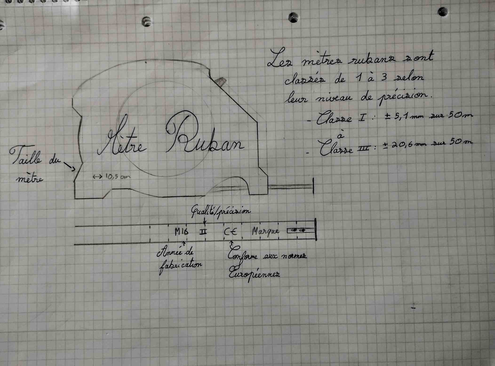
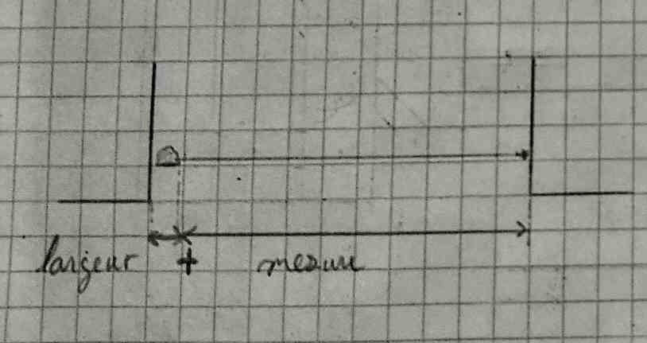
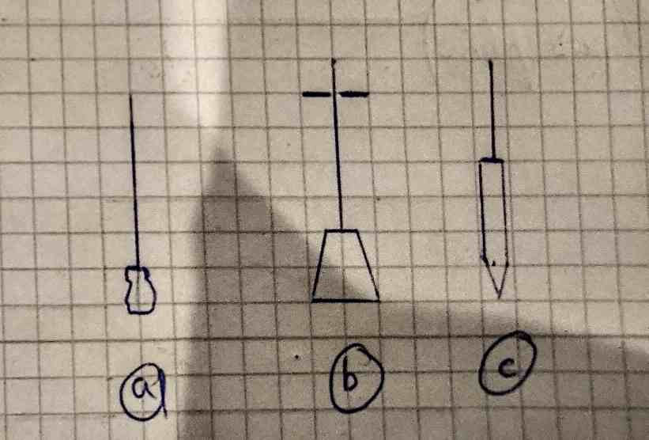
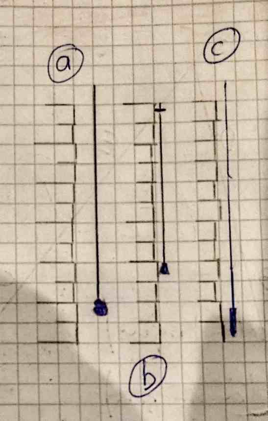

> [Accueil](../../) > [Portail technique](../) > [Portail construction](./) > Utilisation du mêtre et du fil à plombs

## Utilisation du mêtre et du fil à plombs

### Mètre

#### Embout et marquages

#### Mesure espace confiné 

### Fil à plombs

Basique, maçon et tapissier