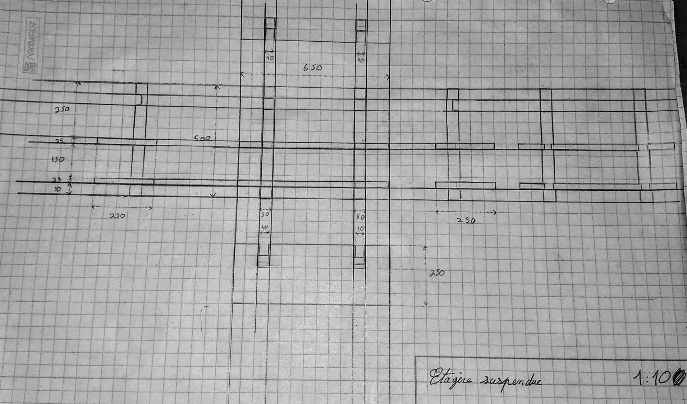
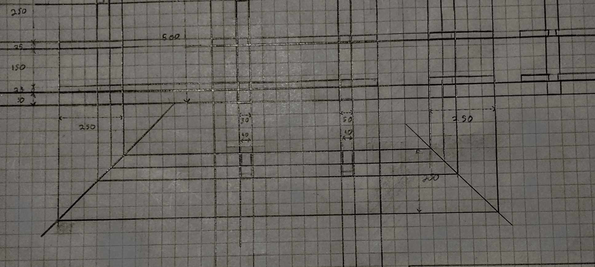
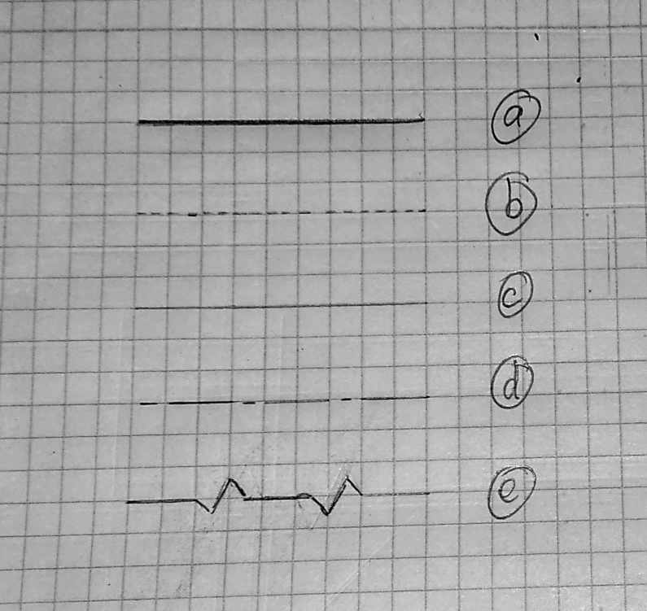

## Faires des plans

Dans de nombreux contextes le plan est un investissement non nécessaire, la flexibilité et l'experience aqcuise empiriquement permet de construire, de fabriquer et de créer des objets sans cette étape. Pour des projets complexes ou dans des situations où préablement une transmission est nécessaire que ce soit pour des raisons de gouvernances ou pédagogique les plans s'avère très utile. 

Il est également parfois nécessaire d'interagir avec des instances étatique ou des entreprises externe. Danc ce cas la création et la lecture de plan est stratégique. Cette première introduction s'inscrit dans ces différentes optiques.

### Un plan, qu'est-ce ?

Un plan est une façon de représenter un objet virtuellement que ce soit sur papier où sur un support numérique. Le plan est ce que la recette est as un gâteau. 

Comme de nombreuses pratiques récurentes des normes et usages ce sont installé. Ils peuvent différer selon le secteur, le pays où le support. Nous allons nous concentrer içi sur les plans papiers en deux dimmensions. 

### Une vue, qu'est-ce?

Une vue est une représentation partiel composant un plan. Quand les objets que nous souhaitons représenter, de fait abstraire, nous ne pourrons probablement pas représenter tous les détails dans un même dessins. Nous utilisons donc différentes vues pour permettre de donner une vision suffisement exhaustives de ce que nous voulons représenté.

Une vue de devant associé vues d'autres perspectives enrichie notre compréhension de l'objet. Une vue des forces, de la résistance calorique, de l'aération sont d'autant de possibilité pour mieux apréhender la conception d'un objet, d'une maison, ou d'un outil. 

### Dispositions et correspondances entre les vues

Imaginons une pièce placée dans un cube. Sur chaque face de ce cuber nous représentons l'objet en deux dimensions comme "vue" par la face. Autrement dit nous projetons l'objet sur les murs du cube.

Dessiner le cube ci dessus est d'une complexité inutile nous préferrons dessiner le cube déplier. Nous dessinerons les faces cotes à cotes comme un patron d'un tel cube.

Sur ces différentes vues nous ajoutons des repères permetant de mieux apréhender ce qui ce passe à l'interieur de ce que nous représentons. La disposition des vues est normalisé avec la vue de face au centre et les autres disposé à gauche, à droite, au dessus et dessous comme dans le schéma ci dessus. 

Nous ajoutons également les cotes (les mesures) des différents élements (cf ci dessous).

Une cohérence et une correspondances horizontale et verticale est aussi attendue entre ces vues comme le montre le shéma si dessous.

Ainsi qu'une correspondance à "45 degrée". 

### Les différents type de traits

- (a) **Trait continue:** Arrêtes et contours visible 
- (b) **Trait pointillé:** Arrêtes et contours cachés
- (c) **Trait fin:** Cotes et reperes
- (d) **Trait mixtes:** Coupes et sections
- (e) **Traits zigzag:** Limites de vues

### Coupes et sections

Pour mieux appréhender ce qui se passe à l'intérieur d'une pièce il est possible de faire une coupe que l'on annote sur schéma par un trait mixte, des flèches, et une étiquette. 

Les flèches indique le sens d'observation de la coupe ou de la section.

Une section est simmilaire à une coupe mais concerne qu'une partie d'une pièces de l'ensemble comme çi dessous.

Il est possible de réduire l'empreinte (la place que le schéma occupe) en faisant le dessin de la section directement sur la pièce on parle de section rabbatue en opposition à la section sortie vue si dessus.

