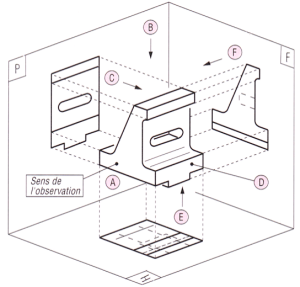
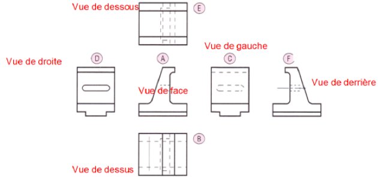
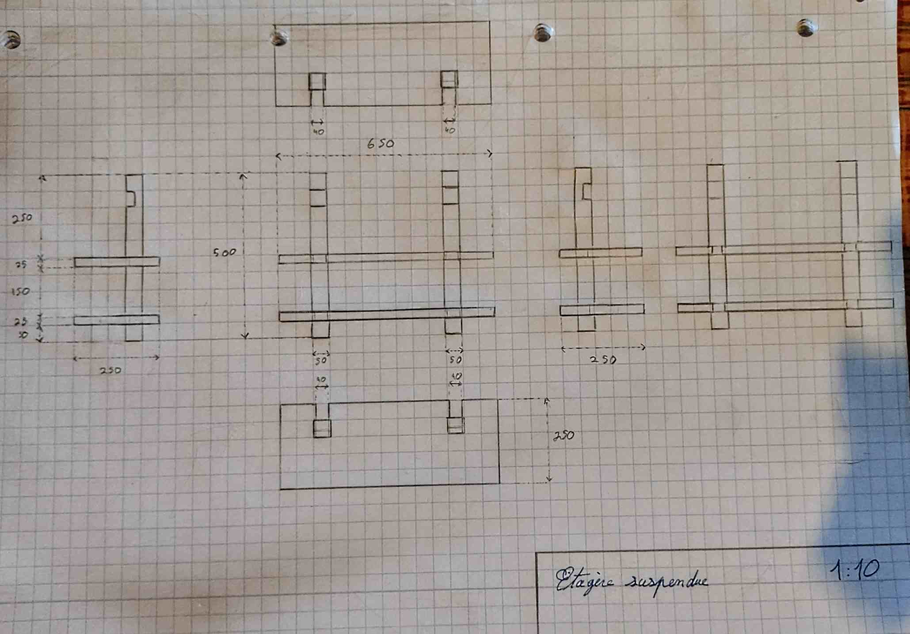
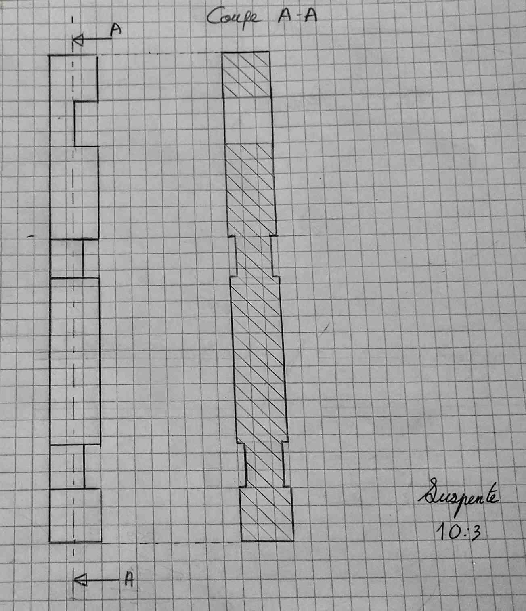
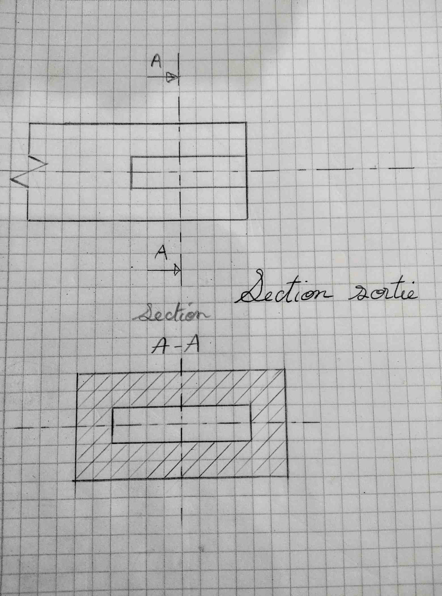
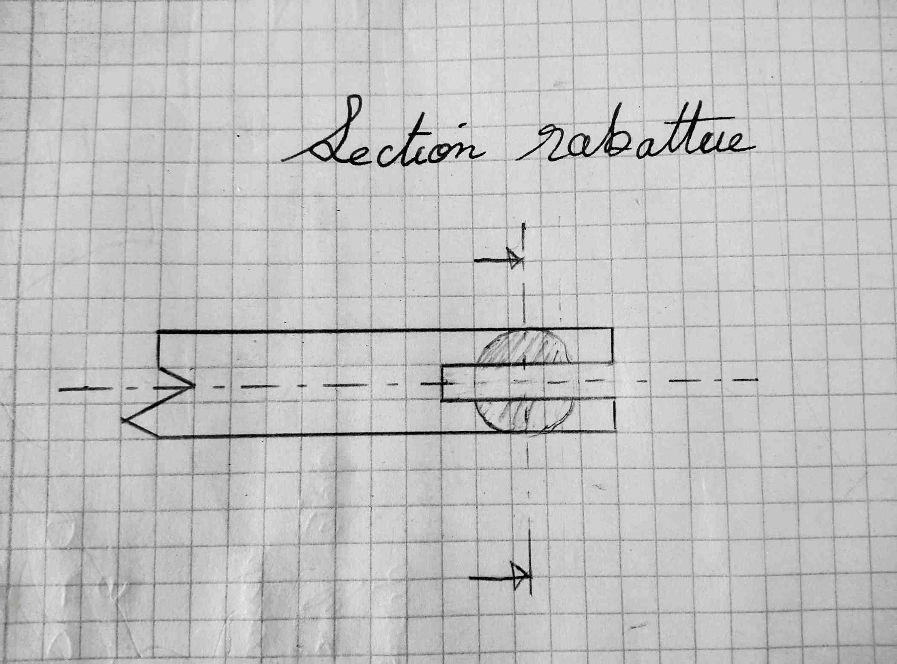

> [Accueil](../../) > [Portail technique](../) > [Portail construction](./) > Faires des plans

## Faires des plans

### Dispositions et correspondances entre les vues

### Les différents type de traits

### Coupes et sections

