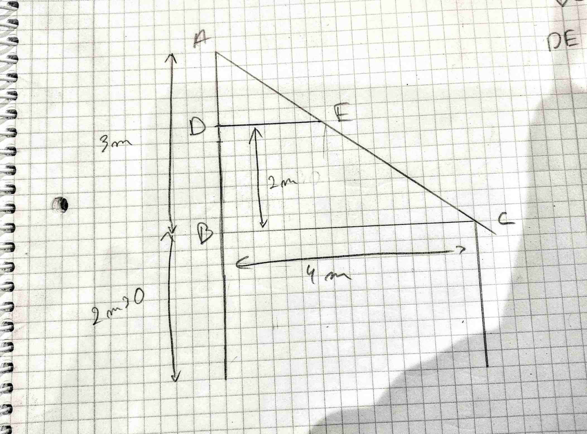

> [Accueil](../../) > [Portail technique](../) > [Portail construction](./) > Thales et pythagore

## Thales et pythagore

### Thales


Le theorem de thales énonce que:

```
DE/BC=AE/AC=AD/AB
```

Super ça! À quoi cela nous sert ?

Dans le cas d'une maison/abbris comme ci dessous:


Nous voulons rajouter un faux plafond dans le but d'isoler. Nous voulons calculer la longueur de la planche/chevron/(etc) nécessaire. Nous pouvons annoter comme suit:



Nous cherchons a calculer la longueur DE. Thales nous permet de faire ce qui suit:

```
DE/BC=AD/AB
DE=BC.AD/AB
DE=4*1/3
soit environ 1,333 m
```

### Pythagore


Le théorème de Pythagore ennonce:

AB<sup>2</sup>+AC<sup>2</sup>=BC<sup>2</sup>

BC étant l'hypothénuse. Soit le carré de l'hypothénuse est égale à la somme des carrés des deux autres cotés.

Pour celle et ceux qui déteste des formules sortant de nulle part, ci dessous est la preuve visuel de ce théoreme.


> Dans (1) nous avons un carré de coté a+b contenant 4 triangles abc. Ces triangles forment un carré inscrit de coté c. Autrement dit, l'aire restant sans les triangle est égale à c<sup>2</sup>.

> Dans (2) nous réarangeons les triangles sans changer leur taille, de fait sans changer la quatité de place qu'ils occupent. L'air restant ne change donc pas et reste égale à c<sup>2</sup>.

> Ce réarangement permet également de voir que l'air restant égale a c<sup>2</sup> est composé de deux autres carré respectivement de coté a et b . Nous observons donc que c<sup>2</sup> équivaut effectivement à a<sup>2</sup> + b<sup>2</sup> 

Voici comment ce théorème peut nous être utile dans le cas vus ci-dessus.


Le faux plafond maintenant installé nous souhaitons calculer la superficie de lambris à poser sous les combles. Imaginons un triangle en projetant E sur BC. Autrement dit un point que l'on peut nommer E' sur BC et où E'E est perpendiculaire avec BC.

```
E'E = BD = 2
E'C = BC - DE = 4 - 4/3 soit environ 2,666
Appliquons le théorème de pythagore pour trouver EC
EC² = E'E² + E'C²
EC² = 2²+2,666² = 11,11
Nous cherchons EC et non EC² donc
EC = √(EC²) = √11,11 = 3,333
```

EC est donc égale à 3,333. Si notre abbris est long (ou profond) de 5m il nous faudras 3,333*5 m² de lambris, soit 16,66m²