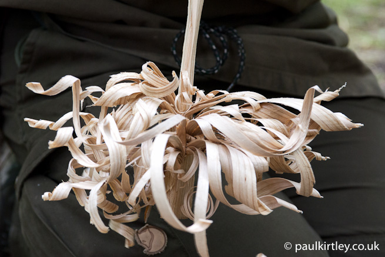

## Présentation

## Trouvez du bois sec

Le meilleur endroit où trouver du bois sec est dans les arbres. Les branches mortes reste loin de l'humidité du sol et sont facile à prélever. Parfois on peut même trouver des arbre entier morts sur pied.

> Le bois mort et sec se reconnait au fait qu'il casse net et ne s'éfiloche pas ou peux.

> Par temps humide que le bois vienne des arbres ou du sol on le fend avec le couteau pour en extraire, au coeur des branche, le bois sec.

## Taille du bois
Un feu s'allume avec du bois de petite taille puis en augmentant le diamêtre doucement. Il peut parfois être difficile de s'y retrouver voici ci desous un guide  

### Phase 1 

Le matériau est du petit bois, on commence avec des tailles croissantes : 
1. la taille d'une allumette 
2. la taille d'un crayon 
3. de la taille d'un doigt 
4. de la taille d'un pouce. 

> Si on peine à trouver suffisamment de matériau pour la phase 1, on utilise son couteau pour en prélever sur un matériau plus gros.

Une fois que vous avez collecté une brassée de petit bois de cette taille, passez à la phase 2 : le combustible en tant que tel. 

### Phase 2

Cela commence à environ la moitié de la largeur de votre poignet et augmente jusqu'à environ la taille de votre avant-bras. Il faut au moins deux grande brassée pour cette phase.

### Phase 3

Le matériau de cette phase 3 sert à entretenir votre feu, des morceaux plus grands de type "bûche". Pour chaque heure de feu souhaitée, vous avez besoin de deux brassées de matériau. Ainsi, pour entretenir un petit feu toute la nuit, vous avez besoin d'une pile qui atteint à peu près votre taille ! Évidemment, plus votre feu est grand, plus il aura besoin de combustible.

## Allumez un feu avec un bâton hérisson

La réalisation d'un baton hérisson se fait avec un couteau sur une matière sèches. Il faut trouvez une branche morte d'environ 4 cm de diamètre. On la divise en quart grâce à notre couteau. Puis nous attaquons le hérisson sur un des quarts.  Le hérisson se forme en créant des fines lamelles de bois sur la partie qui étais au centre de notre baton originale. Les lamelles, vers le fin ne sont pas censé être séparer du quart et y reste fixés côte à côte.

> Ce n'est pas grave si certaines lamelles tombent ils peuvent toujours être utilisé plus tard.

Une fois le hérisson bien garni on peut l'utiliser comme allume-feu. 

## Feu de camp pour cuisson rapide

On commence par former un carré avec quatre piquet dans le sol, avec un diamètre de 3cm et espacé d'environ 12cm, puis on empile le bois couche par couche en alternant de 90°. 

Photo a venir