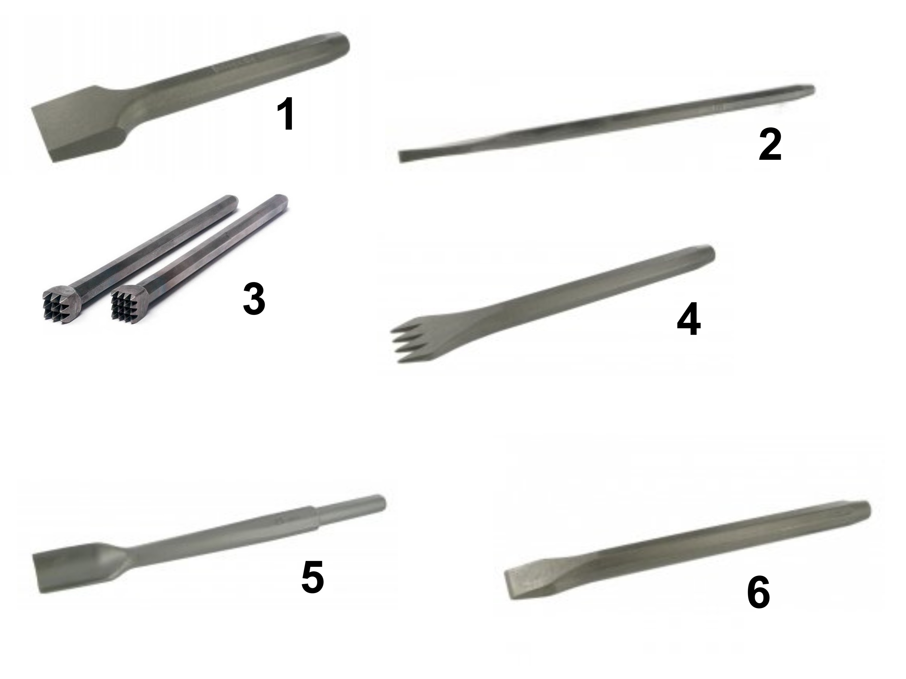
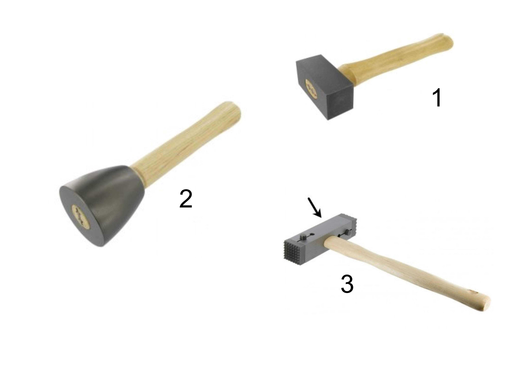
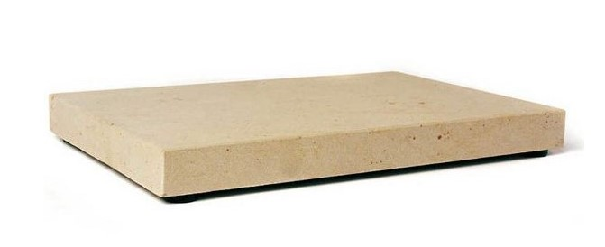

## Identifier les outils en taille de pierre

### Présentation

Cette liste d'outils n'as pas comme objectif d'être exhaustif. C'est une liste orienté pour la taille de pierre traditionnelle sans outils éléctrique ou thermique.

### 🔧 Outils de taille

#### Ciseau

> 6 sur l'image çi-dessus

- Outil de base pour tailler la pierre.
- Utilisé pour les ciselures, les finitions et les coupes précises.
- Peut être droit, plat ou à dents selon l’usage.

#### Gradine

> 4 sur l'image çi-dessus

- Ciseau dentelé à dents pointues ou plates.
- Sert à dégrossir la pierre et à créer une texture striée.
- Utilisé après la chasse pour préparer la surface avant finition.

#### Les chasses

> 1 sur l'image çi-dessus

- Outils à extrémité large et biseautée.
- Permettent d’enlever de gros morceaux de pierre.
- Utilisées pour le dégrossissage initial.

#### Gouges

> 5 sur l'image çi-dessus

- Ciseaux courbes servant à creuser des formes concaves.
- Utilisées pour la sculpture décorative ou le modelage de reliefs.
- Adaptées aux pierres tendres.

#### Boucharde

> 3 sur l'image çi-dessus

- Outil à tête garnie de pointes (acier ou carbure).
- Sert à texturer la surface de la pierre en la rendant rugueuse.
- Utilisée pour les finitions antidérapantes ou esthétiques.

#### Ognette

> 2 sur l'image çi-dessus

- Outil à tranchant étroit (acier ou carbure).
- Sert à évider ou faire des rainures
- Utilisée surtout en marbrerie

### 🔨 Outils de percussion

#### Massette tailleur

> 1 sur l'image çi-dessus

- Massette carrée ou cintrée en acier.
- Utilisée pour frapper les ciseaux et autres outils de taille.
- Existe en plusieurs poids selon la précision souhaitée.

#### Massette ronde ou massette portugaise

> 2 sur l'image çi-dessus

- Massette conique, bien équilibrée pour un impact centré.
- Appréciée pour sa maniabilité et son confort d’utilisation.
- Utilisée pour les travaux de gravure et de sculpture.

#### Marteau boucharde

> 3 sur l'image çi-dessus

- Marteau à tête interchangeable avec plaquettes bouchardées.
- Permet de réaliser des finitions bouchardées sur pierre dure ou tendre.
- Utilisé pour aplanir ou texturer les surfaces.

### 📏 Outils de mesure

#### Le mètre
- Mètre pliant rigide, souvent en aluminium ou plastique.
- Utilisé pour prendre des mesures précises sur la pierre.
- Résiste mieux à la poussière que les mètres souples.

#### Le compas
- Sert à tracer des cercles, reporter des distances ou contrôler des épaisseurs.
- Utilisé en sculpture pour reproduire des volumes.
- Existe en version à pointes carbure pour les pierres dures.

#### L'équerre
- Permet de vérifier les angles droits entre les faces.
- Indispensable pour assurer la précision des coupes et l’assemblage.
- Existe en acier, bois ou plastique.

#### Le cordeau
- Cordelette tendue entre deux points pour tracer une ligne droite.
- Utilisé pour aligner les pierres ou marquer des repères.
- Peut être imprégné de poudre pour laisser une trace visible.

#### Le fil à plomb
- Masse suspendue à un fil pour vérifier la verticalité.
- Utilisé pour contrôler l’aplomb des murs ou des blocs.
- Outil simple mais très précis, utilisé depuis l’Antiquité.

#### La fausse équerre
- Outil à angle réglable pour reporter des angles non droits.
- Composée d’un talon et d’une lame mobile avec vis de blocage.
- Utilisée pour reproduire des angles complexes ou irréguliers.

### Outil d'entretient et de maintenance

#### Pierre de banc

- Grâce à son poids propre élevé, la pierre repose tranquillement sur l'établi.
- Utilisé pour l'affûtage des outils en acier forgé.

#### De l'huile ou de la graisse

- Pour protèger les outils de la rouille lors du stockage

### Equipement de protection individuelle

#### Obligatoire

- Lunette
- Casque anti-bruit

#### C'est mieux

- Chaussure de sécurité
- Gants