# Réalisation du fond croisé

## Usages

Le fond croisé est une technique incontounable pour réaliser de nombreux types d'ouvrages.
On le trouve en effet dans la plupart des corbeilles et des paniers que l'on peut réaliser.

Mais le fond croisé peut servir en tant que tel, par exemple, comme dessous de plat.

## Réalisation

La réalisation du fond croisé se fait en 5 étapes.

Vous aurez besoin d'un couteau (pas besoin d'un aiguisage rasoir, vous n'aurez pas à couper véritablement), d'un sécateur et éventuellement d'un poinçon (un tournevis ou un gros clou fera l'affaire).

Concernant le matériau utilisé, il s'agit ici de noisetier pour l'armature et de la ronce pour le tressage. Mais vous pouvez utiliser de l'osier, du saule sauvage, du cornouiller, de la clématite, et tous les matériaux aptes au tressage "à plein" (qui n'ont pas été fendus pour les assouplir). Vous pouvez aussi utiliser des éclisses. Pour plus de détails, voir notre ressource sur les matériaux de la vannerie (à paraître).

### Faire une croix avec 6 brins de grosse taille

Ici, le matériau utilisé n'est pas de grande importance. Certaines essences sont préférables pour des critères de torsion, de durabilité, de solidité, de résistance à la fente, mais beaucoup d'essences remplissent ces critères. Pour aller au plus simple, prenez du cornouiller, du saule ou du noisetier, si on veut rester dans des espèces fréquentes.

Coupez 6 sections de branches de la même taille et à peu près du même diamètre. Ils peuvent provenir d'une même branche. 

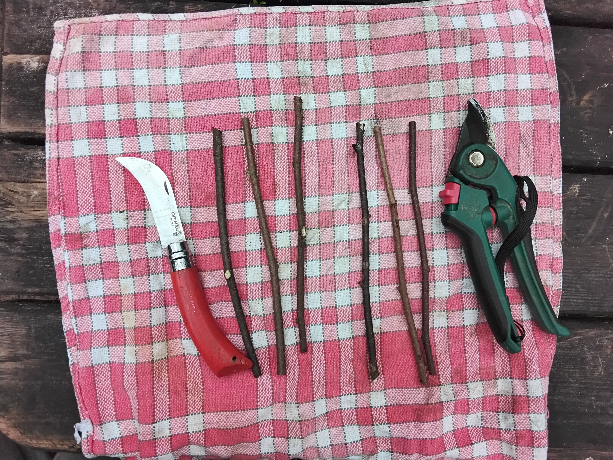

Fendez dans le milieu le plus gros bâton.

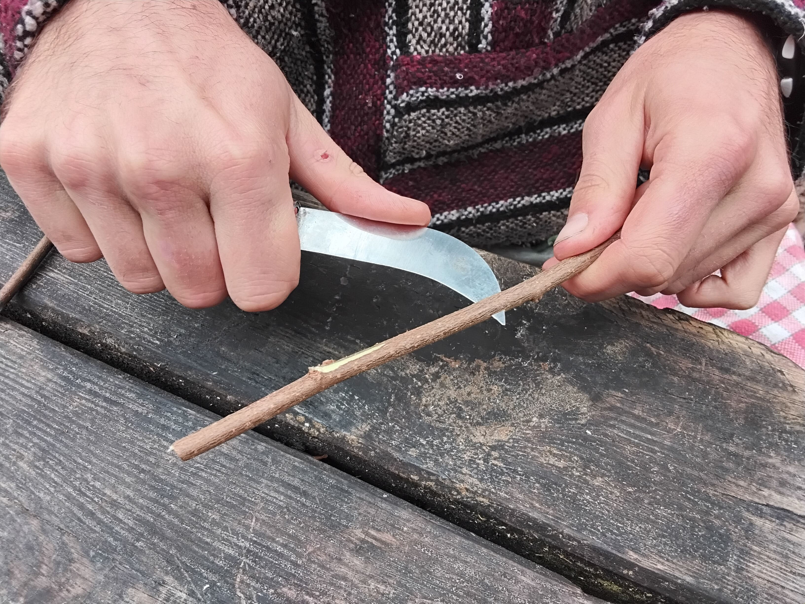

Passez un 1er bâton fendu autour d'un 1er bâton non fendu à l'aide de votre couteau.

😉 Astuce : aidez-vous de votre couteau pour écater la fente et faire la place pour le 1er bâton.

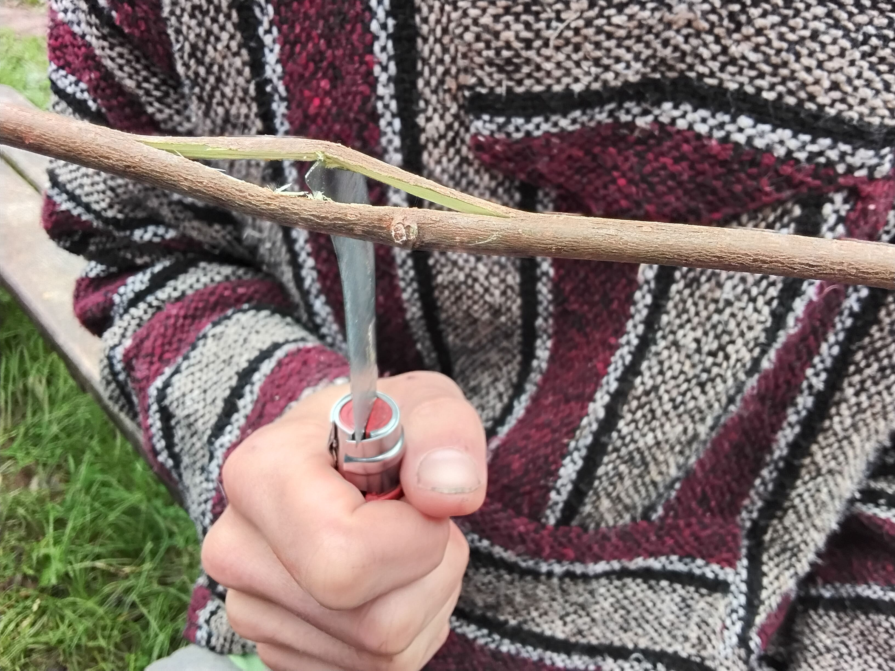

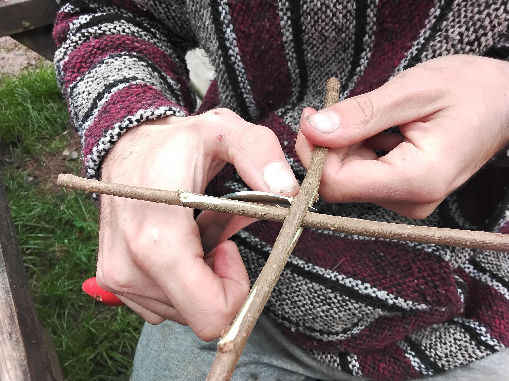

Tordez les 4 brins restant. Vous pouvez appuyer sur votre genou par à-coups sans trop forcer, mais le mieux reste de les assouplir en les frottant sur votre genou sur la longueur.

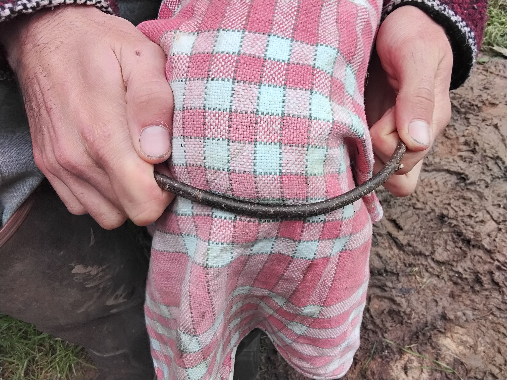

Fendez les 2 autres plus gros bâtons et passez-les autour du 1er bâton non fendu, donc parallèles au 1er bâton fendu.

Passez ensuite vos 2 bâtons restant dans les fentes des 3 bâtons, de part et d'autre du 1er bâton non fendu.

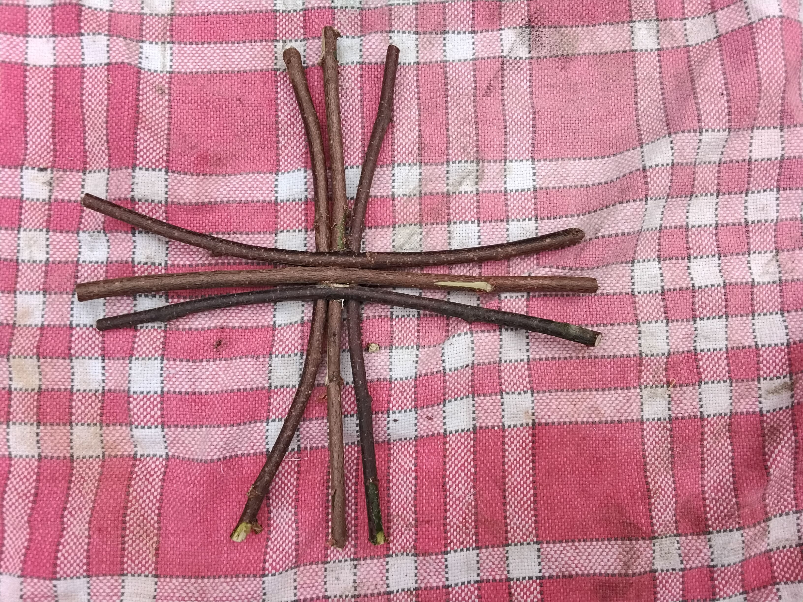

Tordez les 4 bâtons extérieurs autant que faire se peut sans les casser. Le but, idéalement, est d'arriver à réaliser un "soleil" en faisant en sorte que les angles entre les bâtons soient les mêmes. En fonction de la souplesse, vous n'y arriverez peut-être pas parfaitement, mais pas de panique, on peut élargir un peu les écarts entre les bâtons au moment du tressage !

😉 Astuce : si l'un des bâtons ou plusieurs casse(nt) partiellement mais pas complètement (qu'ils sont toujours en un morceau et pas deux), vous pouvez toujours les utiliser pour réaliser votre fond croisé. Il sera seulement moins solide et moins esthétique.

### Le début du tressage (faire un carré autour du centre)

Prenez les 2 brins les plus fins de votre récolte. Ils doivent être assez longs. N'hésitez pas à les assouplir en les frottant sur votre genou comme expliqué plus haut pour les bâtons.

⚠️ Si vous utilisez de la ronce, veillez à les épépiner [enlever les épines, qui sont en fait des aiguillons au sens botanique]. Le plus simple est de le faire avec le dos du couteau (comme sur le photo), mais vous pouvez aussi le faire avec la lame posée à plat sur la ronce et couper les aiguillons. La première méthode a l'avantage d'être moins risquée et vous pouvez faire des va-et-vient rapides et forts sur la ronce sans risquer de la couper. La deuxième méthode requiert plus d'attention.

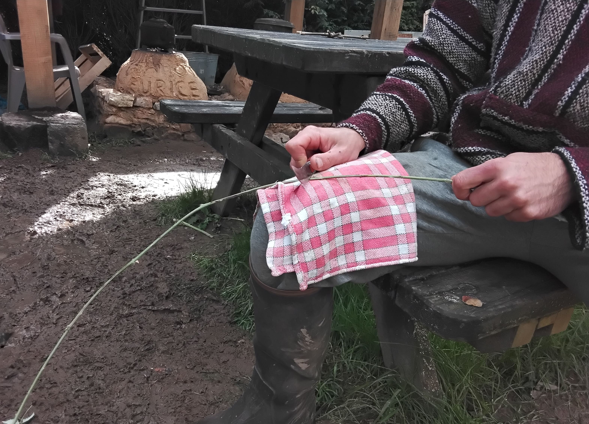

⚠️ Si vous utilisez des matériaux trop gros ou cassants, vous pouvez fendre les brins voire les transformer en éclisses. Pour cela, se référer à notre ressource technique qui en parle : (à paraître prochainement).

Fichez les cimes (les extrémités les plus fines de votre brin) dans l'une des fentes de votre croix.

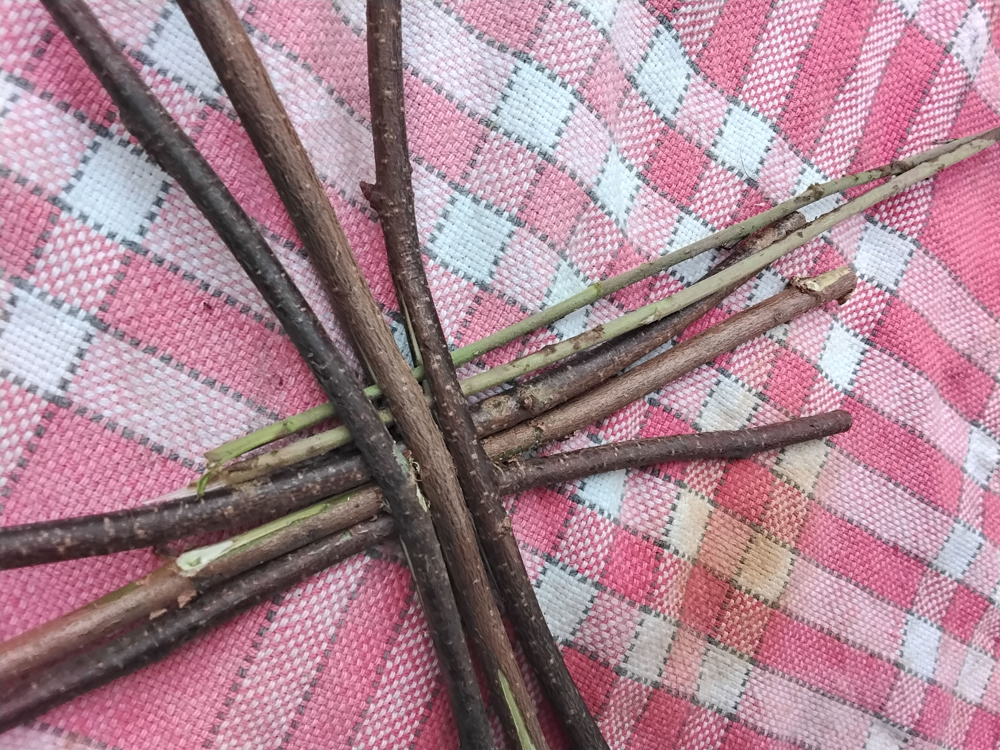

Faites passer un premier brin par dessus les trois bâtons 

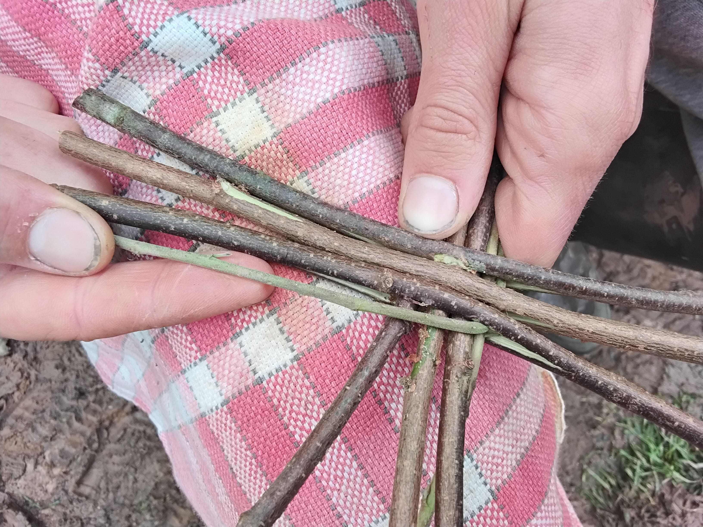

Prenez le deuxième brin et faites-le passer par-dessous ces 3 bâtons et par dessus les 3 bâtons qui suivent

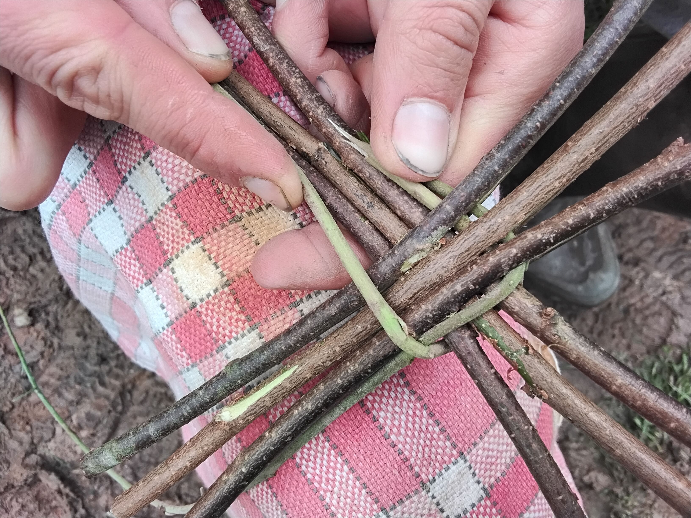

Reprenez le 1er brin et passez-le sous les 3 bâtons, puis par-dessus les 3 bâtons suivants.

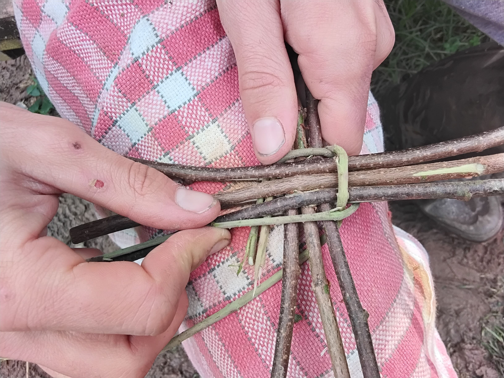

Et ainsi de suite jusqu'à avoir effectué 3 tours.

😉 Astuce : le secret d'une vannerie bien faite, c'est de serrer ! Il faut serrer dans le sens du brin, ainsi que vers l'intérieur de votre fond croisé. 

### Continuation du tressage "en super"

Continuez ensuite ce tressage, mais cette fois-ci autour de 1 bâton à la fois et non pas 3.

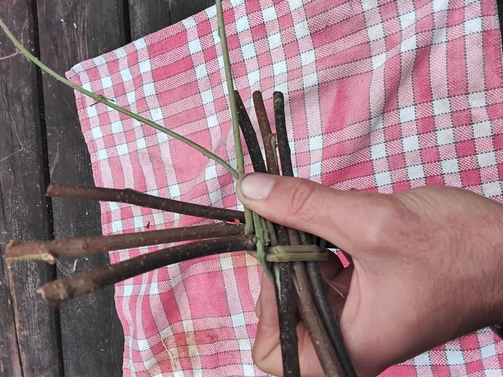

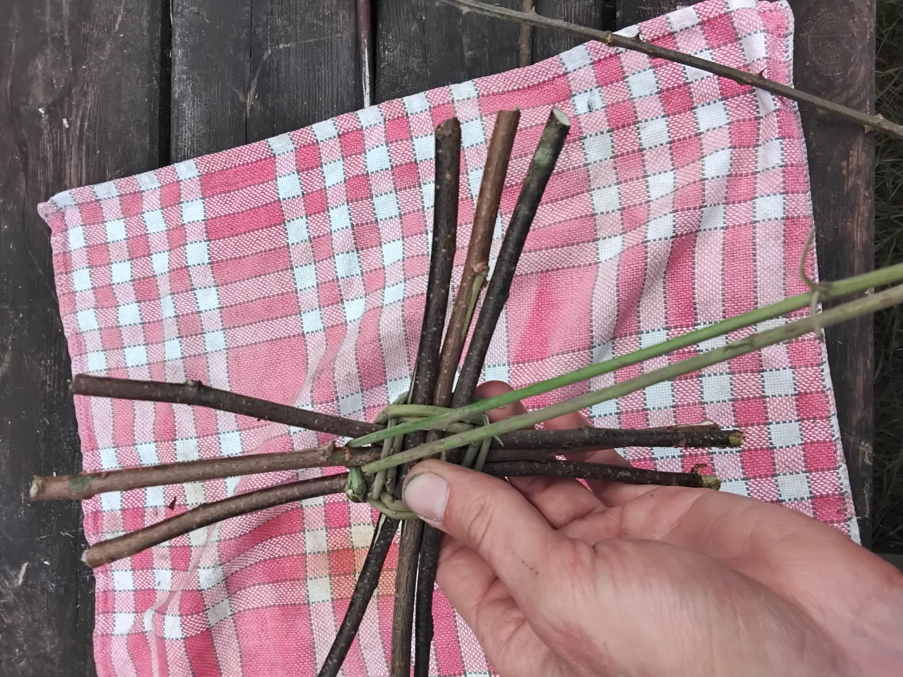

🧐 Remarque : vous êtes en train de réaliser un tressage "en super". Il donne cette impression de croisement entre les brins, contrairement à d'autres types de tressage comme celui "à brin perdu" (aussi appelé "à brin suivi") ou "en crocane". C'est un tressage qui a son esthétique et qui est surtout solide, recommandé entre autre pour la réalisation des fonds croisés. Pour des exemples de tressage "à brin perdu/suivi" ou "en crocane", voir les ressources techniques correspondantes (à paraître)

Petit à petit, continuez d'écarter vos bâtons.

😉 Astuce : une bonne chose à faire, surtout quand vous faites le fond d'une corbeille ou d'un panier, contrairement à un dessous de plat, consiste à bomber votre structure vers le haut sur votre genou. Votre fond croisé sera ainsi plus résistant à la force qu'exerceront les montants, qui auront tendance à bomber la structure vers le bas.

#### Le raboutage

😖 Aïe, vous arrivez à la fin de votre brin !

Pas de panique, on peut tout à fait continuer à tresser. Pour ce faire, prenez un brin de votre récolte et aposez-le contre la fin de votre brin. C'est tout ! Il vous suffit de tresser avec ces nouveaux brins comme si de rien n'était, tout en les maintenant pour ne pas qu'ils s'échappent. Ils seront ensuite conincés quand vous aurez réalisé votre premier tour avec ces nouveaux brins.

En toute logique, vous êtes arrivé au pied du brin que vous venez de finir de tresser, c'est-à-dire à la partie la plus épaisse du brin. Il vous faut donc rabouter pied sur pied, ce qui signifie recommencer le tressage par la partie la plus épaisse de votre nouveau brin.

😉 Astuce : Il est possible de rabouter cime contre pied, c'est-à-dire d'aposer la partie la plus fine de votre nouveau brin sur la partie la plus épaisse du brin précédent. Vous aurez simplement un effet discontinu de votre tressage, comme une rupture, mais cela peut vous aider dans certaines situations, par exemple, quand vos brins ont tendance à casser ou qu'ils sont très gros et que vous tressez avec peu d'espace entre les bâtons (ce qui peut arriver au début du tressage notamment).

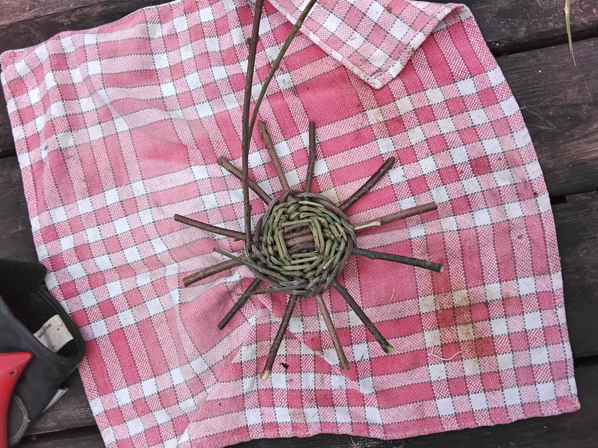

😉 Astuce : faites en sorte que les parties en trop qui dépassent soient toutes du même côté. La dernière étape consiste à les couper et votre fond croisé sera plus beau d'un côté que de l'autre : ce sera la partie visible.

### Finir le tressage

Pour finir votre fond croisé, fichez les derniers brins dans les interstices le long des bâtons.

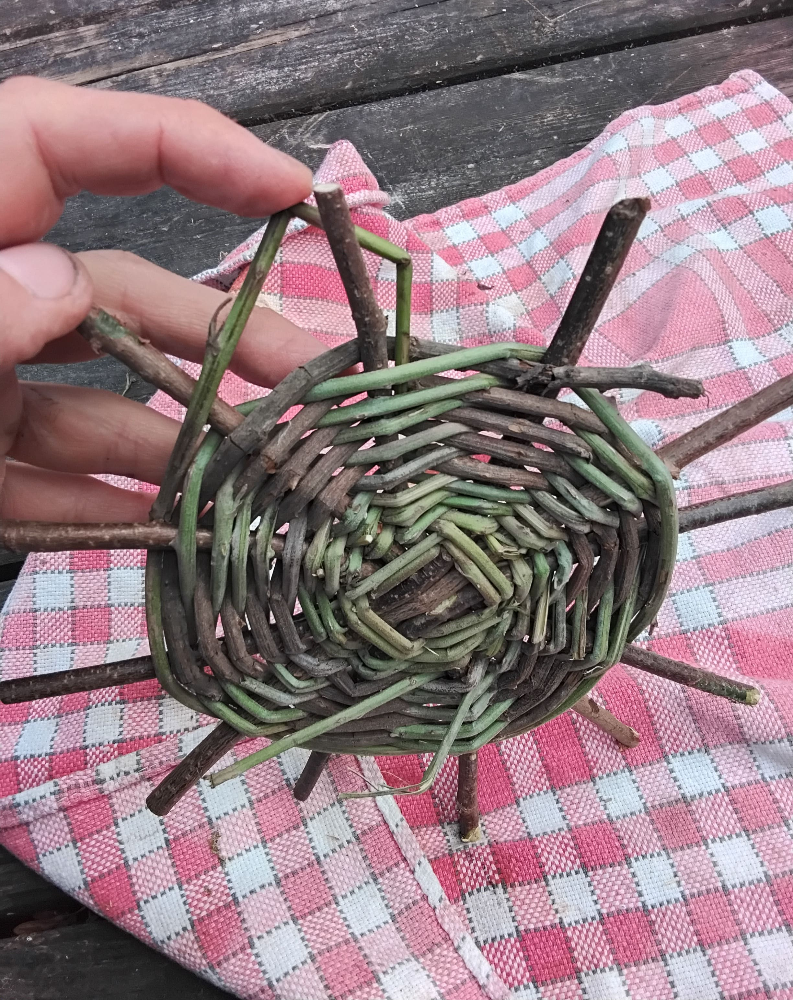

### Epluchage

L'épluchage consiste à enlever les parties non voulues qui résultent du travail de l'ouvrage. On coupe ainsi les parties trop longues des bâtons, les parties de brins qui dépassent, les parties qui s'effilochent.

🥳 Bravo ! Vous avez réalisé un fond croisé !

## Poursuivre

Vous pouvez tout à fait vous arrêter là pour avoir déjà un objet utile. 

Mais vous pouvez poursuivre vers la réalisation d'une corbeille ou d'un panier ici : (à paraître)

